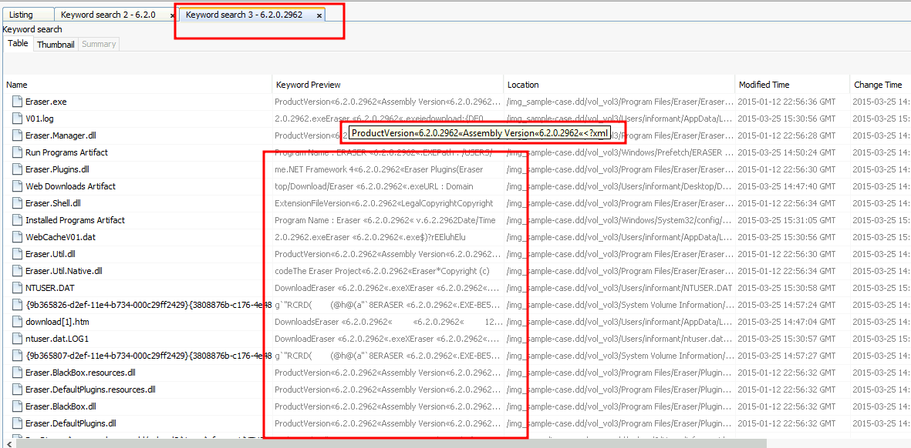
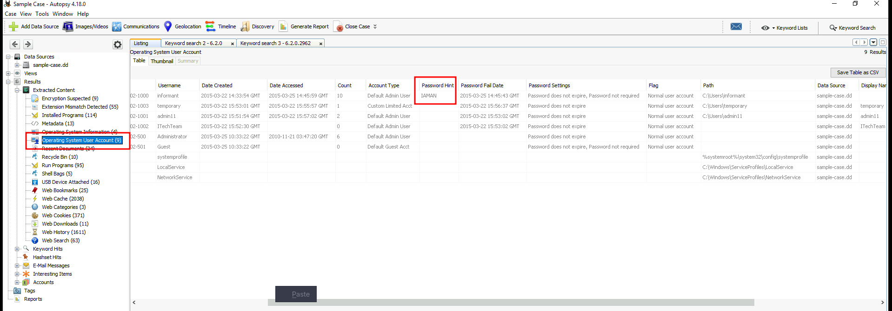
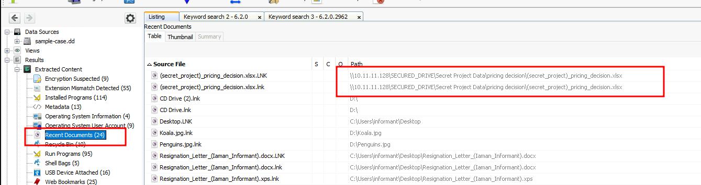
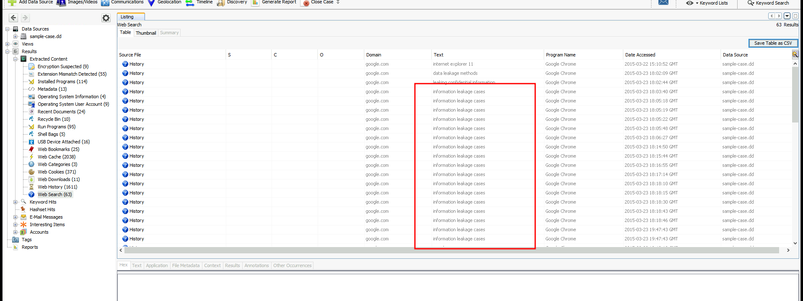
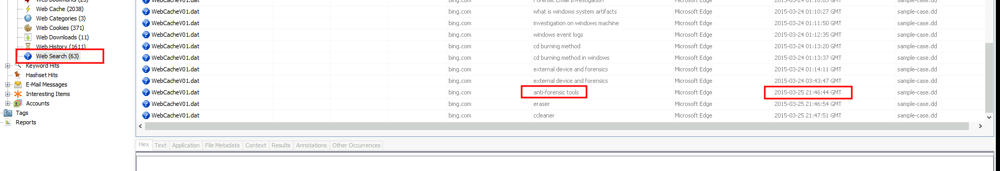
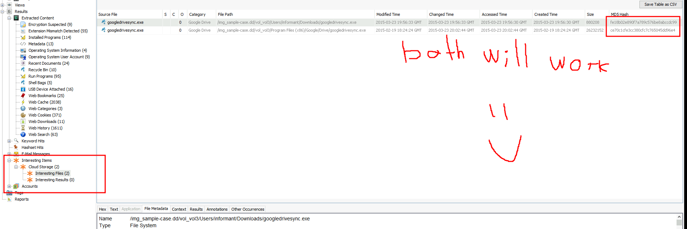
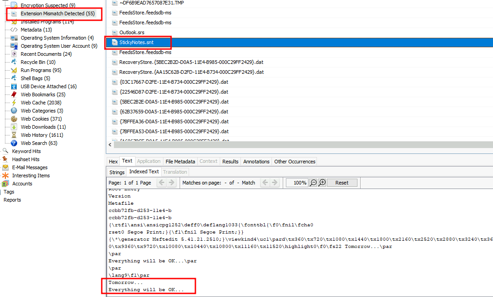

# Introduction to Autopsy: Windows Forensics Walkthrough and Challenge

This guide introduces **Autopsy**, an open-source digital forensics platform for analyzing disk images and logical files, followed by a challenge to investigate a data leak on a Windows virtual machine.

## Introduction to Autopsy

**Autopsy** is a powerful open-source digital forensics platform, partly funded by the Department of Homeland Security. It is designed for analyzing mobile devices, digital media, and disk images, with a plug-in architecture for extensibility. It is widely used in law enforcement, national security, litigation support, and corporate investigations.

### Key Features
- **Case Creation**: Create `.aut` case files with:
  - **Case Name**: User-defined name.
  - **Base Directory**: Root directory for case files.
  - **Case Type**: Single-User (local) or Multi-User (server-based).
- **Data Sources**:
  - **Disk Image/VM File**: Byte-for-byte copies (e.g., `*.img`, `*.e01`, `*.vmdk`).
  - **Local Disk**: Physical drives (e.g., USB).
  - **Logical Files**: Local files/folders.
  - **Unallocated Space**: Files without a file system.
  - **Autopsy Logical Imager Results**: Imager outputs.
- **Supported Disk Image Formats**:
  - Raw Single (`*.img`, `*.dd`, `*.raw`, `*.bin`).
  - Raw Split (`*.001`, `*.002`, etc.).
  - EnCase (`*.e01`, `*.e02`, etc.).
  - Virtual Machines (`*.vmdk`, `*.vhd`).
- **Ingest Modules**: Plug-ins to analyze specific data (e.g., Recent Activity), configurable for files, directories, or unallocated space.
- **Tree Viewer**:
  - **Data Sources**: Files organized like Windows File Explorer.
  - **Views**: Files grouped by type, MIME type, or size.
  - **Results**: Ingest module outputs.
  - **Tags**: Tagged files/results.
  - **Reports**: Generated by modules or analysts.

## Challenge: Investigating Data Leak at Organization X

### Scenario
An employee is suspected of leaking company data. A disk image was retrieved from their machine. Use Autopsy to perform initial analysis of the disk image to investigate the data leak.

### Questions and Findings

#### 1. Name of Installed Program with Version 6.2.0.2962
**Question**: What is the name of an installed program with the version number of 6.2.0.2962?

**Answer**: `Eraser`

#### 2. User Password Hint
**Question**: A user has a password hint. What is the value?

**Answer**: `IAMAN`

#### 3. IP Address of Network Drive
**Question**: Numerous SECRET files were accessed from a network drive. What was the IP address?

**Answer**: `10.11.11.128`

#### 4. Web Search Term with Most Entries
**Question**: What web search term has the most entries?

**Answer**: `information leakage cases`

#### 5. Web Search on 3/25/2015 21:46:44
**Question**: What was the web search conducted on 3/25/2015 21:46:44?

**Answer**: `anti-forensic tools`

#### 6. MD5 Hash of Interesting File
**Question**: What MD5 hash value of the binary is listed as an Interesting File?

**Answer**: `fe18b02e890f7a789c576be8abccdc99`

#### 7. Self-Assuring Message on Sticky Note
**Question**: What self-assuring message did the 'Informant' write for himself on a Sticky Note? (no spaces)

**Answer**: `Tomorrow...EverythingwillbeOK...`

