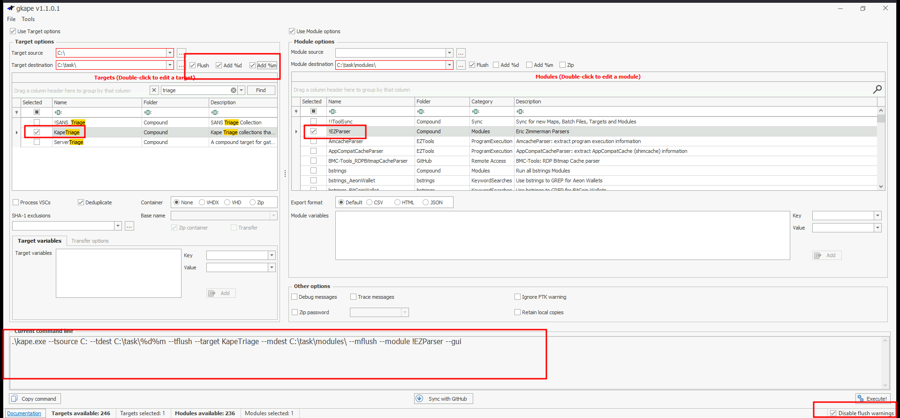

# Introduction to KAPE: Windows Forensics Walkthrough and Challenge

This guide introduces **Kroll Artifact Parser and Extractor (KAPE)**, a tool for collecting and processing Windows forensic artifacts to reduce incident response time. 

## Introduction to KAPE

**Kroll Artifact Parser and Extractor (KAPE)** is a portable tool that collects forensic artifacts from live systems, mounted images, or F-response utilities and processes them to extract data. It serves two purposes:
1. **Collect Files**: Copies artifacts (e.g., registry hives, prefetch files) with original timestamps and metadata.
2. **Process Files**: Runs modules (e.g., Eric Zimmerman’s tools) to generate outputs like CSV or TXT files.

### How KAPE Works
KAPE uses **Targets** (defined in `.tkape` files) to specify artifacts and **Modules** (defined in `.mkape` files) to process them. It collects files in two passes:
- **First Pass**: Copies unlocked files.
- **Second Pass**: Uses raw disk reads to bypass OS locks.
- **Output**: Preserves directory structure and metadata.

### Targets
**Targets** define artifacts to collect, specified in `.tkape` files in `KAPE\Targets`. They include:
- **Path**: Source (e.g., `C:\Windows\Prefetch`).
- **Category**: Artifact type (e.g., EvidenceOfExecution).
- **File Masks**: Patterns (e.g., `*.pf`).

Example: `Prefetch.tkape` collects `*.pf` files from `C:\Windows\Prefetch` and `C:\Windows.old\Prefetch`.

#### Compound Targets
**Compound Targets** combine multiple targets for triage (e.g., `!SANS_triage`, `KAPEtriage`). Example: A compound target for execution evidence collects Prefetch, AmCache, RecentFileCache, and Syscache.

#### Special Directories
- **!Disabled**: Inactive targets excluded from the active list.
- **!Local**: Custom targets not synced with KAPE’s GitHub repository.

### Modules
**Modules** process artifacts using executables in `KAPE\Modules`, defined in `.mkape` files. They specify:
- **Executable**: Program (e.g., `PECmd.exe`).
- **Parameters**: Command-line options.
- **Output**: CSV or TXT files.

The `bin` directory stores non-native executables (e.g., Eric Zimmerman’s tools).

## Walkthrough: Using KAPE for Forensic Analysis

This walkthrough demonstrates KAPE’s GUI version to collect and process artifacts from a Windows VM (user: `thm-4n6`, password: `123`).

### Setup
- **Tool**: KAPE GUI.
- **Triage Data**: `C:\users\THM-4n6\Desktop\triage`.
- **Configuration**: As shown in screenshot.

### Steps
1. Launch KAPE GUI from the VM desktop.
2. Select compound targets (e.g., `!SANS_triage`) or individual targets (e.g., `Prefetch`, `USBDevices`).
3. Set destination (e.g., `C:\temp\kape_output`).
4. Enable modules (e.g., `PECmd`, `JLECmd`).
5. Run KAPE to collect and process artifacts.
6. Review outputs in EZviewer or Notepad.

## Challenge: Investigating Policy Violation at Organization X

### Scenario
Organization X’s Acceptable Use Policy prohibits connecting removable or network drives, installing software from unknown locations, and connecting to unknown networks. A user on a VM (user: `thm-4n6`) is suspected of violating this policy. Use KAPE’s GUI to analyze triage data.

### Questions and Findings

#### 1. Serial Number of the Second USB Device
**Question**: Two USB Mass Storage devices were attached to the VM. One had a serial number `0123456789ABCDE`. What is the serial number of the other USB device?

**Answer**: `1C6F654E59A3B0C179D366AE&0`

#### 2. Drive Letter and Path of Software Installation
**Question**: 7zip, Google Chrome, and Mozilla Firefox were installed from a network drive. What was the drive letter and path of the directory from where these software were installed?

**Answer**: `Z:\Setups`

#### 3. Execution Date and Time of CHROMESETUP.EXE
**Question**: What is the execution date and time of `CHROMESETUP.EXE` in MM/DD/YYYY HH:MM?

**Answer**: `11/25/2021 03:33`

#### 4. Search Query Run on the System
**Question**: What search query was run on the system?

**Answer**: `RunWallpaperSetup.cmd`

#### 5. First Connection Time of Network 3
**Question**: When was the network named `Network 3` first connected to?

**Answer**: `11/30/2021 15:44`

#### 6. Drive Letter of KAPE’s Source
**Question**: KAPE was copied from a removable drive. What was the drive letter of the drive where KAPE was copied from?

**Answer**: `E:`

