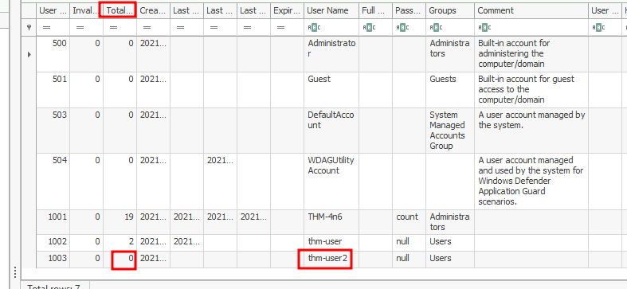
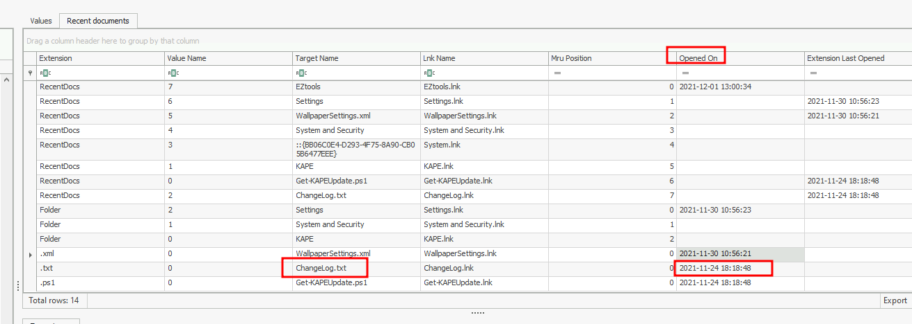

# Introduction to Computer Forensics for Windows

This guide introduces **Computer Forensics** within the context of **Digital Forensics and Incident Response (DFIR)**, focusing on forensic analysis of Microsoft Windows systems. It covers the importance of forensic artifacts, the Windows Registry as a key evidence source, and tools for analyzing registry hives. 

## What is Computer Forensics?

**Computer Forensics** is a subset of **Digital Forensics**, which involves recovering, examining, and analyzing data from digital devices (e.g., computers, smartphones) to investigate incidents. It is used in:
- **Legal Contexts**: Supporting or refuting hypotheses in civil or criminal cases.
- **Corporate Investigations**: Analyzing internal incidents or intrusions.

A notable example is the **BTK serial killer case**, where a floppy disk sent by the killer to a news station contained a deleted Word document. Metadata from the document helped police identify and arrest the suspect, demonstrating the power of digital forensics.

Given Microsoft Windows’ ~72% desktop market share, understanding Windows forensics is critical. This guide focuses on gathering forensic artifacts from the Windows Registry to reconstruct user and system activity.

## Forensic Artifacts

**Forensic Artifacts** are pieces of evidence indicating human activity on a system. In Windows, artifacts include:
- **Registry Keys**: Configuration data, user settings, or recent activity.
- **File System**: Logs, user profiles, or application files.
- **Memory**: Running processes or network connections.
- **Network**: Traffic logs or connection history.

Artifacts are often stored in obscure locations (e.g., registry hives, hidden files) and are used to build a timeline of events. For example, a registry key can indicate a program’s execution, supporting claims of unauthorized activity.

### Are Windows Systems Spying?
Windows tracks user activity (e.g., desktop layouts, browser bookmarks, recent files) to personalize the user experience. While not explicitly malicious, these artifacts are invaluable for forensic investigators. They reside in:
- **Registry**: System and user configuration.
- **User Profiles**: `C:\Users\<username>\` (e.g., `NTUSER.DAT`).
- **Application Files**: Program-specific data.

## Windows Registry Overview

The **Windows Registry** is a hierarchical database storing configuration data for hardware, software, and users. It is a goldmine for forensic analysis, containing details about recent files, programs, and devices.

### Accessing the Registry
- **Live System**: Use `regedit.exe` (Run: `Win + R`, type `regedit.exe`) to view the registry.
- **Disk Image**: Analyze registry hives (files) in `C:\Windows\System32\Config` or user profile directories.

### Registry Structure
The registry is organized into five **root keys**:
- **HKEY_CURRENT_USER (HKCU)**: User-specific settings (e.g., screen colors, Control Panel).
- **HKEY_USERS (HKU)**: All loaded user profiles; HKCU is a subkey.
- **HKEY_LOCAL_MACHINE (HKLM)**: System-wide settings for all users.
- **HKEY_CLASSES_ROOT (HKCR)**: File associations and program settings, merging `HKLM\Software\Classes` and `HKCU\Software\Classes`.
- **HKEY_CURRENT_CONFIG**: Hardware profile used at system startup.

### Registry Hives
Hives are files storing groups of keys and values:
- **System Hives** (`C:\Windows\System32\Config`):
  - `DEFAULT` (`HKEY_USERS\DEFAULT`)
  - `SAM` (`HKEY_LOCAL_MACHINE\SAM`)
  - `SECURITY` (`HKEY_LOCAL_MACHINE\Security`)
  - `SOFTWARE` (`HKEY_LOCAL_MACHINE\Software`)
  - `SYSTEM` (`HKEY_LOCAL_MACHINE\System`)
- **User Hives** (`C:\Users\<username>\`):
  - `NTUSER.DAT` (`HKEY_CURRENT_USER`, hidden file)
  - `USRCLASS.DAT` (`HKEY_CURRENT_USER\Software\Classes`, in `C:\Users\<username>\AppData\Local\Microsoft\Windows`)
- **AmCache Hive** (`C:\Windows\AppCompat\Programs\Amcache.hve`): Tracks recently executed programs.

### Transaction Logs and Backups
- **Transaction Logs** (e.g., `SAM.LOG`, `SAM.LOG1`): Record recent registry changes, stored in the same directory as hives.
- **Backups** (`C:\Windows\System32\Config\RegBack`): Copies of hives created every 10 days, useful for detecting deleted or modified keys.

## Forensic Data Acquisition

For forensic integrity, analyze copies of registry hives to avoid contaminating evidence:
- **KAPE**: Automates live or disk image data acquisition, including registry hives.
- **Autopsy**: Extracts files from live systems or disk images via the "Extract File(s)" option.
- **FTK Imager**: Exports registry hives from live systems (“Obtain Protected Files”) or disk images, excluding `Amcache.hve`.

### Viewing Registry Hives
- **Registry Viewer (AccessData)**: Similar to `regedit.exe`, loads one hive at a time, no transaction log support.
- **Registry Explorer (Eric Zimmerman)**: Loads multiple hives, integrates transaction logs, and bookmarks forensically significant keys.
- **RegRipper**: Generates text reports from hives, but requires pre-merged transaction logs for accuracy.

## Key Registry Locations for Forensics

### System Information
- **OS Version**: `SOFTWARE\Microsoft\Windows NT\CurrentVersion` (ProductName, CurrentVersion).
  - Displays Windows version (e.g., Windows 10). Provides context for artifact locations, as registry structures vary by OS version.
- **Current Control Set**: `SYSTEM\Select\Current` identifies the active control set (`ControlSet001` or `ControlSet002`).
  - `SYSTEM\Select\LastKnownGood`: Last known good configuration.
  - `SYSTEM\CurrentControlSet`: Volatile hive for current boot settings, critical for accurate system configuration analysis.
- **Computer Name**: `SYSTEM\CurrentControlSet\Control\ComputerName\ComputerName` (ComputerName value).
  - Verifies the machine’s identity, ensuring analysis targets the correct system.
- **Time Zone**: `SYSTEM\CurrentControlSet\Control\TimeZoneInformation` (TimeZoneKeyName).
  - Aligns event timestamps (UTC vs. local time) for accurate timeline creation.
- **Network Interfaces**: `SYSTEM\CurrentControlSet\Services\Tcpip\Parameters\Interfaces` (IP addresses, DNS servers).
  - Confirms network configuration and machine identity.
- **Past Networks**: `SOFTWARE\Microsoft\Windows NT\CurrentVersion\NetworkList\Signatures\Managed` and `Unmanaged` (network names, last connected time).
  - Tracks network connections, useful for detecting unauthorized access via external networks.

### User Activity
- **Autostart Programs**:
  - `NTUSER.DAT\Software\Microsoft\Windows\CurrentVersion\Run` and `RunOnce`: Programs launched at user login.
  - `SOFTWARE\Microsoft\Windows\CurrentVersion\Run` and `RunOnce`: System-wide autoruns.
  - `SYSTEM\CurrentControlSet\Services`: Services with `Start=0x02` (auto-start at boot).
  - Identifies persistence mechanisms used by attackers.
- **SAM Hive**: `SAM\Domains\Account\Users` (user accounts, RIDs, login times, password policies).
  - Reveals account creation, logins, and potential unauthorized accounts.
- **Recent Files**:
  - `NTUSER.DAT\Software\Microsoft\Windows\CurrentVersion\Explorer\RecentDocs`: Recently opened files, sorted by Most Recently Used (MRU).
  - `NTUSER.DAT\Software\Microsoft\Windows\CurrentVersion\Explorer\RecentDocs\.pdf`: Extension-specific recent files.
  - Tracks user file interactions, critical for timeline reconstruction.
- **Office Recent Files**: `NTUSER.DAT\Software\Microsoft\Office\VERSION` (e.g., `15.0` for Office 2013) or `NTUSER.DAT\Software\Microsoft\Office\VERSION\UserMRU\LiveID_####\FileMRU` (Office 365).
  - Lists recently opened Office documents, aiding in identifying user activity.
- **ShellBags**: `USRCLASS.DAT\Local Settings\Software\Microsoft\Windows\Shell\Bags` and `BagMRU` (folder layouts, recently accessed folders).
  - Reveals folder access patterns, useful for detecting unauthorized navigation.
- **Open/Save Dialogs**: `NTUSER.DAT\Software\Microsoft\Windows\CurrentVersion\Explorer\ComDlg32\OpenSavePIDlMRU` and `LastVisitedPidlMRU` (file open/save locations).
  - Tracks file access locations, indicating recent user interactions.
- **Explorer Bars**: `NTUSER.DAT\Software\Microsoft\Windows\CurrentVersion\Explorer\TypedPaths` (address bar paths) and `WordWheelQuery` (search queries).
  - Provides evidence of user navigation and search activity.
- **UserAssist**: `NTUSER.DAT\Software\Microsoft\Windows\CurrentVersion\Explorer\UserAssist\{CEBFF5CD-ACE2-4F4F-9178-9926F41749EA}\Count` (GUI-launched programs, execution times, counts).
  - Tracks application launches via Windows Explorer, critical for identifying executed programs.

### Program Execution
- **ShimCache**: `SYSTEM\CurrentControlSet\Control\Session Manager\AppCompatCache` (file name, size, last modified time).
  - Use **AppCompatCacheParser** to parse into CSV format. Tracks all executed applications for compatibility.
- **AmCache**: `Amcache.hve\Root\File\{Volume GUID}\` (execution paths, times, SHA1 hashes).
  - Stores detailed program execution data, including deleted files.
- **BAM/DAM**: `SYSTEM\CurrentControlSet\Services\bam\UserSettings\{SID}` and `dam\UserSettings\{SID}` (background app paths, execution times).
  - Monitors background application activity, useful for detecting unauthorized processes.

### USB and Removable Devices
- **Device Identification**: `SYSTEM\CurrentControlSet\Enum\USBSTOR` and `USB` (vendor ID, product ID, connection times).
  - Identifies connected USB devices, critical for detecting data exfiltration.
- **First/Last Times**: `SYSTEM\CurrentControlSet\Enum\USBSTOR\Ven_Prod_Version\USBSerial#\Properties\{83da6326-97a6-4088-9453-a19231573b29}\####` (0064: first connection, 0066: last connection, 0067: last removal).
  - Provides precise USB connection timelines.
- **Volume Name**: `SOFTWARE\Microsoft\Windows Portable Devices\Devices` (device names, correlated with USBSTOR GUIDs).
  - Links device names to USB identifiers for comprehensive device tracking.

## Investigation Scenario: Organization X Desktop

### Scenario
A desktop in Organization X’s research lab shows signs of unauthorized access, with multiple user accounts detected. A network drive and USB device may have been connected. Triage data was collected, and registry hives were analyzed using **Registry Explorer**, merging transaction logs (e.g., `.LOG1`, `.LOG2`) to create clean hives for analysis.

### Investigation Process
- **Tools**: Used Registry Explorer to load and analyze registry hives (`SAM`, `NTUSER.DAT`, `SYSTEM`, `Amcache.hve`), integrating transaction logs for accuracy.
- **Hives Analyzed**:
  - `SAM`: For user account details.
  - `NTUSER.DAT`: For recent file access and user activity.
  - `SYSTEM`: For USB and system configuration.
  - `Amcache.hve`: For program execution.
- **Method**: Loaded hives with transaction logs (`*.LOG1`, `*.LOG2`) in Registry Explorer, which prompted for log integration to create clean hives. Navigated to relevant keys and used bookmarks for forensically significant data.

### Questions and Findings

#### 1. Number of User-Created Accounts
**Question**: How many user-created accounts are present on the system?

**Search**: Loaded `SAM\Domains\Account\Users` in Registry Explorer to list user accounts, excluding built-in accounts (e.g., Administrator, Guest).

**Finding**: Three user-created accounts were found.

**Answer**: 3

**Explanation**: The `SAM\Domains\Account\Users` key lists all user accounts by their Relative Identifier (RID). Filtering out system accounts (e.g., RID 500 for Administrator) revealed three user-created accounts, indicating potential unauthorized account creation. This key is critical for identifying account-related anomalies.

#### 2. Username of Account Never Logged In
**Question**: What is the username of the account that has never been logged in?

**Search**: Inspected `SAM\Domains\Account\Users` for login counts and times, identifying `thm-user2` with zero logins.

**Finding**: The account is `thm-user2`.

**Answer**: `thm-user2`

**Explanation**: The `SAM\Domains\Account\Users` key includes login-related values (e.g., `LastLogonTime`). A zero login count for `thm-user2` indicates it was created but never used, suggesting a potential backdoor or unused account, a common tactic in unauthorized access.

#### 3. Password Hint for User THM-4n6
**Question**: What’s the password hint for the user THM-4n6?

**Search**: Navigated to `SAM\Domains\Account\Users\<RID for THM-4n6>` to check the password hint value.

**Finding**: The password hint is `count`.

**Answer**: `count`

**Explanation**: The `SAM` hive stores password hints under user-specific subkeys, accessible via the user’s RID. The hint `count` for `THM-4n6` could indicate a weak or guessable password, making it a potential target for attackers.

#### 4. Access Time of Changelog.txt
**Question**: When was the file `Changelog.txt` accessed?

**Search**: Checked `NTUSER.DAT\Software\Microsoft\Windows\CurrentVersion\Explorer\RecentDocs` for `Changelog.txt` and its Last Accessed Time.

**Finding**: The file was accessed on `2021-11-24 18:18:48`.

**Answer**: `2021-11-24 18:18:48`

**Explanation**: The `RecentDocs` key tracks file access with Most Recently Used (MRU) timestamps. The `LastWriteTime` for `Changelog.txt` confirms its access time, aiding in constructing a timeline of user activity on the system.

#### 5. Path of Python 3.8.2 Installer Execution
**Question**: What is the complete path from where the python 3.8.2 installer was run?

**Search**: Loaded `C:\Users\THM-4n6\Desktop\NTUSER.DAT_clean` in Registry Explorer and navigated to `Software\Microsoft\Windows\CurrentVersion\Explorer\UserAssist\{CEBFF5CD-ACE2-4F4F-9178-9926F41749EA}\Count` to find the execution path for `python-3.8.2.exe`.

**Finding**: The path is `Z:\setups\python-3.8.2.exe`.

**Answer**: `Z:\setups\python-3.8.2.exe`

**Explanation**: The `UserAssist` key, specifically `NTUSER.DAT\Software\Microsoft\Windows\CurrentVersion\Explorer\UserAssist\{CEBFF5CD-ACE2-4F4F-9178-9926F41749EA}\Count`, tracks GUI-launched applications, including their full paths and execution times. The path `Z:\setups\python-3.8.2.exe` indicates the installer was run from a network or external drive, suggesting potential unauthorized access to external resources.

#### 6. Last Connection Time of USB Device Named ‘USB’
**Question**: When was the USB device with the friendly name `USB` last connected?

**Search**: Navigated to `SYSTEM\CurrentControlSet\Enum\USBSTOR` and `SOFTWARE\Microsoft\Windows Portable Devices\Devices` in Registry Explorer to correlate the `USB` device’s GUID and check the `0066` value (last connection time).

**Finding**: The last connection was on `2021-11-24 18:40:06`.

**Answer**: `2021-11-24 18:40:06`

**Explanation**: The `USBSTOR` key logs device connection times under `Properties\{83da6326-97a6-4088-9453-a19231573b29}\0066` (last connection). Correlating with `Portable Devices\Devices` confirmed the `USB` device’s last connection time, indicating potential data exfiltration or malware delivery via USB.

## Recommendations
- **Investigate Accounts**: Audit `thm-user2` for malicious creation, as it has never been logged into, and review `THM-4n6`’s password strength due to its weak hint (`count`).
- **Analyze Network Drive**: Investigate access to `Z:\setups`, as `python-3.8.2.exe` was executed from a network drive, which may indicate unauthorized access.
- **Check USB Activity**: Examine the `USB` device connected on 2021-11-24 for data transfers or malware introduction.
- **Enhance Logging**: Enable detailed logging for `SAM`, `UserAssist`, `RecentDocs`, and `USBSTOR` to detect future unauthorized activity.
- **Use Clean Hives**: Always merge transaction logs (`.LOG1`, `.LOG2`) in Registry Explorer to ensure accurate analysis, as done with `NTUSER.DAT_clean`.
- **Secure Evidence**: Preserve triage data copies and maintain chain of custody to ensure forensic integrity.

## Documentation
- Microsoft Registry Documentation: [docs.microsoft.com](https://docs.microsoft.com/en-us/windows/win32/sysinfo/registry)
- TryHackMe Rooms:
  - [KAPE](https://tryhackme.com/room/kape)
  - [Autopsy](https://tryhackme.com/room/btautopsye0)
  - [Windows Forensics 1](https://tryhackme.com/room/windowsforensics1)
