# Windows Forensics 2: File Systems and Artifact Analysis

This guide explores **Windows Forensics**, focusing on file systems (FAT, exFAT, NTFS) and their forensic significance, as well as key artifacts for investigating program execution, file access, and device connections on a Windows system. 

## File Systems in Windows Forensics

File systems organize raw bits on a storage device into meaningful data structures, enabling forensic investigators to locate and analyze artifacts. Understanding file system structures is crucial for recovering deleted files and identifying system activity.

### File Allocation Table (FAT)
The **FAT** file system, used since the 1970s, organizes data using a **File Allocation Table** to index file locations. It remains relevant for USB drives, SD cards, and digital cameras, though it is no longer Windows’ default file system.

#### Data Structures
- **Clusters**: Basic storage units containing file data.
- **Directory**: Stores file metadata (name, starting cluster, length).
- **File Allocation Table**: A linked list tracking cluster status and connections.

#### FAT Variants
- **FAT12**: 12-bit addressing, max 4,096 clusters, 32MB volume size.
- **FAT16**: 16-bit addressing, max 65,536 clusters, 2GB volume size.
- **FAT32**: 28-bit addressing, max 268,435,456 clusters, 2TB volume size (Windows limits formatting to 32GB).
- **Limitations**: Max file size of 4GB (FAT16/FAT32), minimal security features.

#### Forensic Relevance
FAT is common on removable media. Forensic tools analyze directories and the FAT to recover file metadata and deleted files, as cluster data persists until overwritten.

### exFAT
Developed for larger media (e.g., SD cards >32GB), **exFAT** supports:
- **Cluster Size**: 4KB to 32MB.
- **Max File/Volume Size**: 128PB.
- **Max Files per Directory**: 2,796,202.
- **Use Case**: Digital cameras, SD cards, due to lightweight design and large file support.

#### Forensic Relevance
exFAT’s prevalence in modern removable media makes it critical for analyzing USBs and SD cards, with tools like Autopsy extracting file metadata and deleted content.

### New Technology File System (NTFS)
Introduced in 1993 with Windows NT 3.1, **NTFS** is the default file system for modern Windows systems, offering advanced features over FAT.

#### Key Features
- **Journaling**: `$LOGFILE` (in volume root) logs metadata changes, aiding crash recovery.
- **Access Controls**: User-based permissions and ownership for files/directories.
- **Volume Shadow Copy**: Tracks file changes, enabling restoration of previous versions (targeted by ransomware to prevent recovery).
- **Alternate Data Streams (ADS)**: Allows multiple data streams in a single file (e.g., Zone Identifier for downloaded files, used by malware to hide code).
- **Master File Table (MFT)**: A database of all files, containing metadata like paths, timestamps, and cluster locations.

#### MFT Key Files
- **$MFT**: First record, maps all files and clusters.
- **$LOGFILE**: Transactional log for file system integrity.
- **$UsnJrnl** (in `$Extend`): Update Sequence Number Journal, logs file changes and reasons (e.g., creation, deletion).

#### Forensic Relevance
NTFS’s MFT, `$LOGFILE`, and `$UsnJrnl` provide detailed file metadata, timestamps, and change logs, critical for reconstructing events and recovering data.

## Deleted Files and Data Recovery

When a file is deleted, its MFT entry is marked as unallocated, but the data remains on disk until overwritten. Forensic tools recover these files by analyzing MFT records and unallocated clusters.

### Disk Image
A **disk image** is a bit-by-bit copy of a drive, preserving metadata and content. Benefits:
- Prevents contamination of original evidence.
- Allows analysis without specialized hardware.

### Recovering Files with Autopsy
**Autopsy** is an open-source forensic tool for analyzing disk images and recovering deleted files. Process:
1. Create a new case and select “Disk Image or VM File.”
2. Load the disk image (e.g., `usb.001`).
3. Deselect unnecessary ingest modules to speed up processing.
4. View file contents, with deleted files marked by an “X.”
5. Right-click to extract deleted files.

## Forensic Artifacts for Execution and Activity

### Windows Prefetch Files
**Prefetch files** (`*.pf`) in `C:\Windows\Prefetch` store data to optimize program loading, including:
- Last run times.
- Run count.
- Files and devices accessed.

**Tool**: **PECmd.exe** (Eric Zimmerman) parses prefetch files.
- Command: `PECmd.exe -f <path-to-pf-file> --csv <output-path>` or `-d <prefetch-directory>`.

### Windows 10 Timeline
The **Windows 10 Timeline** (`ActivitiesCache.db`) in `C:\Users\<username>\AppData\Local\ConnectedDevicesPlatform\{randomfolder}\` tracks application and file usage, including focus time.

**Tool**: **WxTCmd.exe** (Eric Zimmerman) parses the timeline database.
- Command: `WxTCmd.exe -f <path-to-ActivitiesCache.db> --csv <output-path>`.

### Jump Lists
**Jump Lists** in `C:\Users\<username>\AppData\Roaming\Microsoft\Windows\Recent\AutomaticDestinations` track recently opened files and applications via taskbar shortcuts, including execution times and AppIDs.

**Tool**: **JLECmd.exe** (Eric Zimmerman) parses jump lists.
- Command: `JLECmd.exe -f <path-to-jumplist-file> --csv <output-path>`.

### Shortcut Files
**Shortcut files** (`*.lnk`) in `C:\Users\<username>\AppData\Roaming\Microsoft\Windows\Recent\` and `C:\Users\<username>\AppData\Roaming\Microsoft\Office\Recent\` store:
- First and last opened times.
- File paths (local or remote).

**Tool**: **LECmd.exe** (Eric Zimmerman) parses shortcut files.
- Command: `LECmd.exe -f <path-to-lnk-file> --csv <output-path>`.

### IE/Edge History
**IE/Edge history** (`WebCacheV*.dat`) in `C:\Users\<username>\AppData\Local\Microsoft\Windows\WebCache\` logs accessed files (with `file:///` prefix), including non-browser activity.

**Tool**: Autopsy, with “Recent Activity” ingest module, extracts file access details.

### Setupapi.dev.log
The **setupapi.dev.log** in `C:\Windows\inf\` logs device installations, including:
- Device IDs.
- Serial numbers.
- First/last connection times.

## Investigation Scenario: Windows Machine Analysis

### Scenario
Triage data from a Windows machine (user: `thm-4n6`, password: `123`) is analyzed to investigate file system artifacts, deleted files, program execution, and USB activity. Tools like **MFTECmd**, **PECmd**, **WxTCmd**, **JLECmd**, **LECmd**, and **Autopsy** are used on the attached VM, with results viewed via **EZviewer** or Notepad.

### Investigation Process
- **Environment**: Accessed the VM via RDP, used elevated Command Prompt (`C:\Users\THM-4n6\Desktop\Eztools`) for Eric Zimmerman’s tools, and ran Autopsy from the Desktop.
- **Data Sources**:
  - `$MFT` for file metadata.
  - Disk image (`usb.001`) for deleted file recovery.
  - Prefetch, Timeline, Jump Lists, Shortcut files, and WebCache for activity.
  - `setupapi.dev.log` for USB details.
- **Method**: Parsed files with specified commands, saved outputs as CSVs, and analyzed in EZviewer or Autopsy. Ensured forensic integrity by working on triage copies.

### Questions and Findings

#### 1. Size of SceSetupLog.etl
**Question**: What is the size of the file located at `.\Windows\Security\logs\SceSetupLog.etl`?

**Search**: Ran `MFTECmd.exe -f C:\users\THM-4n6\Desktop\triage\C\$MFT --csv C:\temp`, viewed output in EZviewer, and located `SceSetupLog.etl`.

**Finding**: The file size is 49,152 bytes.

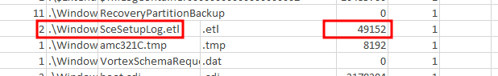

**Answer**: 49152

**Explanation**: The `$MFT` file, parsed by **MFTECmd**, contains metadata for all files, including size. The `SceSetupLog.etl` file in `.\Windows\Security\logs\` is a system log, and its size (49,152 bytes) was extracted from the MFT record, indicating its presence and integrity.

#### 2. Cluster Size of the Volume
**Question**: What is the size of the cluster for the volume from which this triage was taken?

**Search**: Parsed `$MFT` with `MFTECmd.exe -f C:\users\THM-4n6\Desktop\triage\C\$MFT --csv C:\temp`, checked volume metadata for cluster size.

**Finding**: The cluster size is 4,096 bytes.

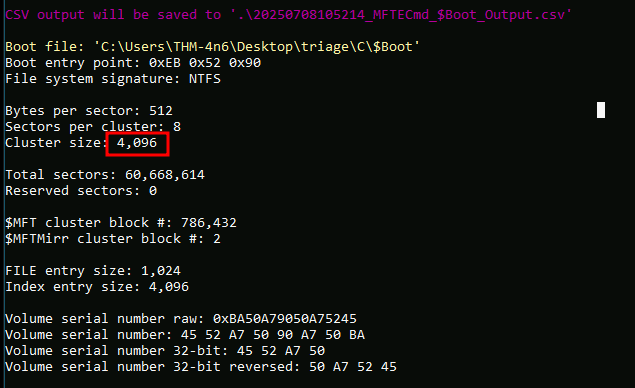

**Answer**: 4096

**Explanation**: The `$MFT` metadata includes volume properties, such as cluster size. A 4,096-byte (4KB) cluster is standard for NTFS volumes, confirmed via MFTECmd’s output, providing context for file allocation analysis.

#### 3. Name of the Deleted XLSX File
**Question**: There is another xlsx file that was deleted. What is the full name of that file?

**Search**: Loaded `usb.001` disk image in Autopsy, selected “Disk Image or VM File,” deselected ingest modules, and viewed deleted files (marked with “X”) under Data Sources.

**Finding**: The file is `Tryhackme.xlsx`.

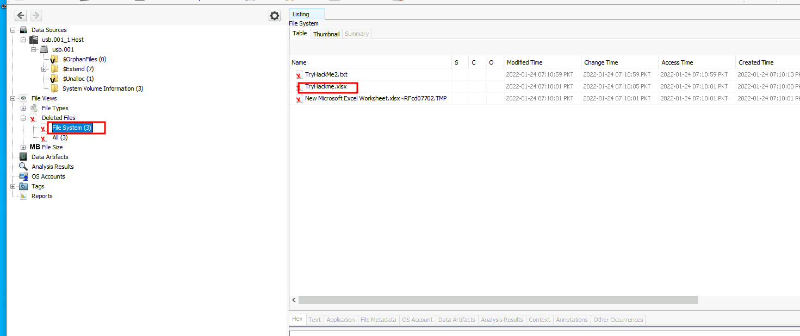

**Answer**: `Tryhackme.xlsx`

**Explanation**: Autopsy’s file view identifies deleted files by their MFT entries. `Tryhackme.xlsx` was marked as deleted, indicating potential data loss or malicious activity, recoverable until overwritten.

#### 4. Name of the Deleted TXT File
**Question**: What is the name of the TXT file that was deleted from the disk?

**Search**: In Autopsy, navigated to `usb.001` Data Sources, identified deleted files with “X” marker.

**Finding**: The file is `TryHackMe2.txt`.

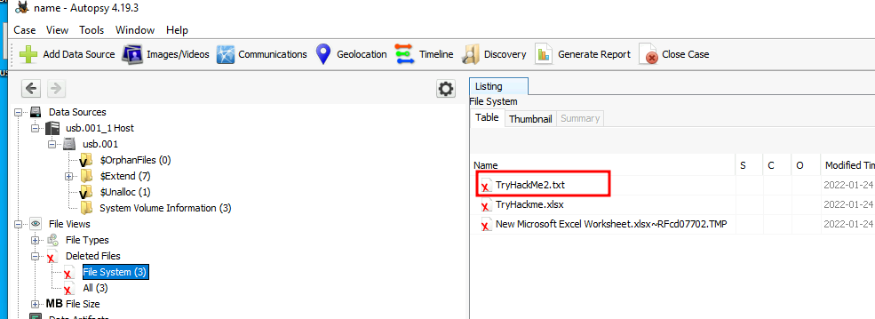

**Answer**: `TryHackMe2.txt`

**Explanation**: Autopsy’s analysis of the disk image revealed `TryHackMe2.txt` as a deleted file in the MFT, suggesting it was recently removed, possibly by unauthorized activity.

#### 5. Content of the Recovered TXT File
**Question**: Recover the TXT file from Question #2. What was written in this txt file?

**Search**: In Autopsy, right-clicked `TryHackMe2.txt`, selected “Extract File(s),” opened the recovered file in Notepad, and viewed its contents.

**Finding**: The content is `thm-4n6-2-4`.

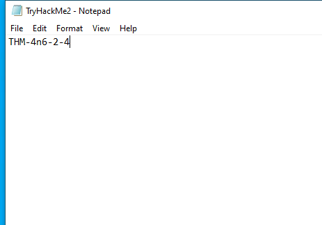
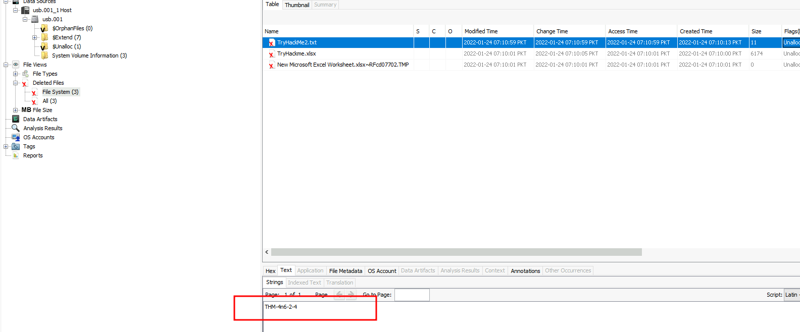

**Answer**: `thm-4n6-2-4`

**Explanation**: Autopsy recovered `TryHackMe2.txt` from unallocated MFT space. The content `thm-4n6-2-4` may be a note, password, or identifier, providing insight into user or attacker activity.

#### 6. Execution Count of gkape.exe
**Question**: How many times was `gkape.exe` executed?

**Search**: Ran `PECmd.exe -d C:\Windows\Prefetch --csv C:\temp`, viewed output in EZviewer, and checked `gkape.exe` run count.

**Finding**: `gkape.exe` was executed 2 times.

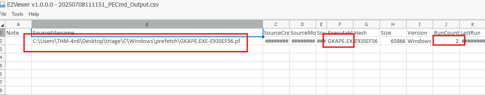

**Answer**: 2

**Explanation**: Prefetch files (`*.pf`) in `C:\Windows\Prefetch` track execution counts. PECmd parsed the `gkape.exe` prefetch file, showing it ran twice, indicating repeated use, possibly by an investigator or attacker.

#### 7. Last Execution Time of gkape.exe
**Question**: What is the last execution time of `gkape.exe`?

**Search**: Used `PECmd.exe -d C:\Windows\Prefetch --csv C:\temp`, checked `gkape.exe`’s last run time in EZviewer.

**Finding**: Last execution was `12/01/2021 13:04`.

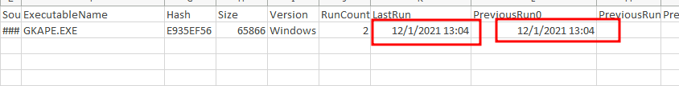

**Answer**: `12/01/2021 13:04`

**Explanation**: The prefetch file for `gkape.exe` logs its last execution time. The timestamp `2021-12-01 13:04` helps establish a timeline of forensic tool usage or potential misuse.

#### 8. Focus Time of Notepad.exe
**Question**: When `Notepad.exe` was opened on 11/30/2021 at 10:56, how long did it remain in focus?

**Search**: Ran `WxTCmd.exe -f C:\Users\THM-4n6\AppData\Local\ConnectedDevicesPlatform\L.thm-4n6\ActivitiesCache.db --csv C:\temp`, checked `Notepad.exe` entry for 11/30/2021 10:56.

**Finding**: Focus time was 00:00:41.

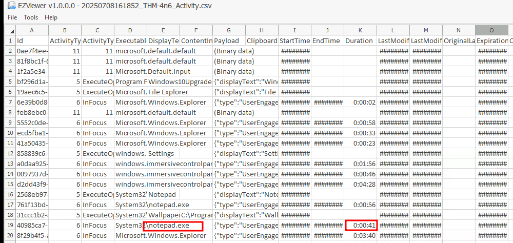

**Answer**: `00:00:41`

**Explanation**: The Windows 10 Timeline (`ActivitiesCache.db`) logs application focus times. WxTCmd confirmed `Notepad.exe` was active for 41 seconds, indicating brief usage, possibly for viewing a file.

#### 9. Program Used to Open ChangeLog.txt
**Question**: What program was used to open `C:\Users\THM-4n6\Desktop\KAPE\KAPE\ChangeLog.txt`?

**Search**: Ran `JLECmd.exe -d C:\Users\THM-4n6\AppData\Roaming\Microsoft\Windows\Recent\AutomaticDestinations --csv C:\temp`, checked Jump List for `ChangeLog.txt`.

**Finding**: The program was `Notepad.exe`.

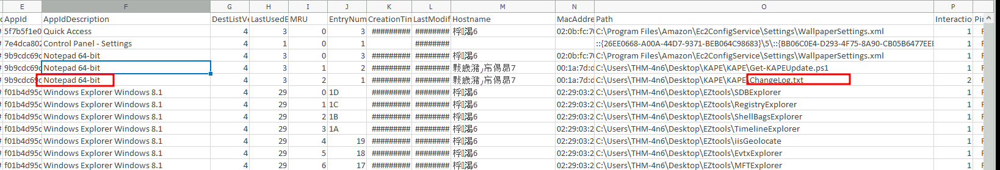

**Answer**: `Notepad.exe`

**Explanation**: Jump Lists track file associations with applications. JLECmd’s output linked `ChangeLog.txt` to `Notepad.exe`, confirming it was opened with Notepad, a common text editor.

#### 10. Last Opened Time of regripper Folder
**Question**: When was the folder `C:\Users\THM-4n6\Desktop\regripper` last opened?

**Search**: Ran `JLECmd.exe -d C:\Users\THM-4n6\AppData\Roaming\Microsoft\Windows\Recent\AutomaticDestinations --csv C:\temp`, checked `regripper` folder’s last access time.

**Finding**: Last opened on `12/1/2021 13:01`.

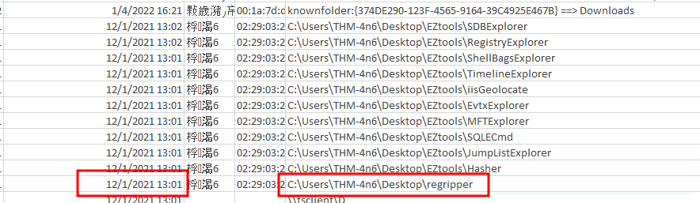

**Answer**: `12/1/2021 13:01`

**Explanation**: Jump Lists record folder access times. JLECmd’s output showed `regripper` was last accessed at `2021-12-01 13:01`, suggesting recent interaction with forensic tools.

#### 11. First Opened Time of regripper Folder
**Question**: When was the above-mentioned folder first opened?

**Search**: Used `JLECmd.exe -d C:\Users\THM-4n6\AppData\Roaming\Microsoft\Windows\Recent\AutomaticDestinations --csv C:\temp`, checked `regripper` folder’s creation time.

**Finding**: First opened on `12/1/2021 12:31`.

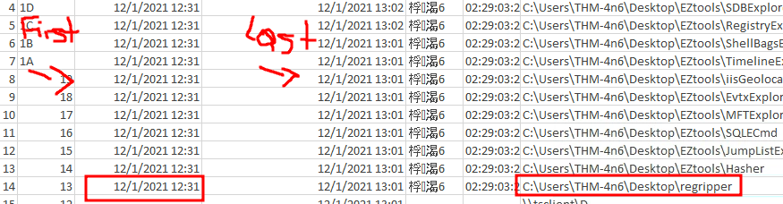

**Answer**: `12/1/2021 12:31`

**Explanation**: Jump Lists log folder creation times as the first access. JLECmd confirmed `regripper` was first opened at `2021-12-01 12:31`, aligning with the investigation timeline.

## Documentation
- Microsoft File Systems: [docs.microsoft.com](https://docs.microsoft.com/en-us/windows/win32/fileio/file-systems)
- TryHackMe Rooms:
  - [Autopsy](https://tryhackme.com/room/btautopsye0)
  - [Windows Forensics 1](https://tryhackme.com/room/windowsforensics1)
  - [Windows Forensics 2](https://tryhackme.com/room/windowsforensics2)
