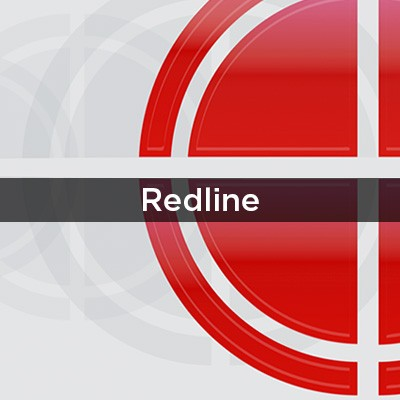

# DFIR: An Introduction

This guide introduces **Digital Forensics and Incident Response (DFIR)**, a critical field in cybersecurity that combines digital forensics and incident response to investigate security incidents, identify attacker activities, and restore compromised systems. 

## What is DFIR?

**DFIR** stands for **Digital Forensics and Incident Response**. It involves collecting forensic artifacts from digital devices (e.g., computers, smartphones, media devices) to investigate security incidents. DFIR helps security professionals:
- Identify attacker footprints and the extent of compromise.
- Remove attackers from the network.
- Restore systems to their pre-incident state.

### The Need for DFIR
DFIR supports security professionals by:
- Detecting evidence of attacker activity and filtering false positives.
- Ensuring complete removal of attacker footholds.
- Determining the scope and timeline of a breach for stakeholder communication.
- Identifying security gaps to prevent future breaches.
- Understanding attacker behavior to block further intrusions.
- Sharing threat intelligence with the community.

### Who Performs DFIR?
DFIR requires expertise in:
- **Digital Forensics**: Identifying artifacts (evidence of activity) on digital devices.
- **Incident Response**: Using forensic data to analyze and respond to security incidents.

DFIR professionals combine these skills to investigate incidents effectively, leveraging the interdependence of forensics (evidence collection) and incident response (defining investigation scope).

## Key DFIR Concepts

### Artifacts
Artifacts are evidence of system activity, such as files, registry keys, or network logs. For example, a registry key used for persistence is an artifact supporting claims of attacker activity. Artifacts are collected from:
- **File System**: Logs, files, or configurations.
- **Memory**: Volatile data like running processes.
- **Network**: Traffic logs or connection records.

### Evidence Preservation
To maintain evidence integrity:
- Evidence is collected and write-protected to prevent contamination.
- Analysis is performed on a copy of the write-protected evidence.
- Original evidence remains untouched to ensure reliability.

### Chain of Custody
The chain of custody ensures evidence integrity by restricting access to authorized personnel. Unauthorized handling can contaminate evidence, weakening the investigation by introducing unknowns.

### Order of Volatility
Digital evidence varies in volatility (likelihood of being lost). For example:
- **High Volatility**: RAM (lost on power-off).
- **Low Volatility**: Hard drives (persistent storage).
DFIR prioritizes capturing volatile evidence (e.g., RAM before hard drives) to preserve critical data.

### Timeline Creation
A chronological timeline of events is created from collected artifacts to:
- Organize activities from multiple sources.
- Provide a clear narrative of the incident.
- Enhance analysis by correlating events.

## DFIR Tools

Several tools assist in DFIR by automating artifact collection, analysis, and timeline creation:

### Eric Zimmerman's Tools
Developed by security researcher Eric Zimmerman, these tools analyze Windows artifacts (e.g., registry, file system) and create timelines.

**Resources**:
- [Windows Forensics 1](https://tryhackme.com/room/windowsforensics1)
- [Windows Forensics 2](https://tryhackme.com/room/windowsforensics2)

### KAPE
Kroll Artifact Parser and Extractor (KAPE), also by Eric Zimmerman, automates artifact collection and parsing, aiding timeline creation.

**Resource**: [KAPE Room](https://tryhackme.com/room/kape)

### Autopsy
An open-source forensics platform for analyzing data from hard drives, mobile devices, and removable media, enhanced by plugins.

**Resource**: [Autopsy Room](https://tryhackme.com/room/btautopsye0)

### Volatility
A memory analysis tool for Windows and Linux, extracting valuable data from memory captures.

**Resource**: [Volatility Room](https://tryhackme.com/room/volatility)

### Redline
FireEye’s free tool for collecting and analyzing forensic data during incident response.

**Resource**: [Redline Room](https://tryhackme.com/room/btredlinejoxr3d)

### Velociraptor
An open-source platform for endpoint monitoring, forensics, and response.

**Resource**: [Velociraptor Room](https://tryhackme.com/room/velociraptorhp)

## Incident Response Process

Incident Response (IR) leverages DFIR to manage security incidents. The process follows standardized frameworks, such as NIST SP-800-61 and SANS PICERL, which are nearly identical.

### NIST SP-800-61
- Preparation
- Detection and Analysis
- Containment, Eradication, and Recovery
- Post-Incident Activity

**Resource**: [NIST SP-800-61](https://nvlpubs.nist.gov/nistpubs/SpecialPublications/NIST.SP.800-61r2.pdf)

### SANS PICERL
- **Preparation**: Establish people, processes, and technology for incident prevention and response.
- **Identification**: Detect incidents via indicators, analyze for false positives, and document findings.
- **Containment**: Limit incident impact with short-term and long-term fixes based on forensic analysis.
- **Eradication**: Remove the threat, ensuring forensic analysis confirms no residual attacker presence.
- **Recovery**: Restore disrupted services to their pre-incident state.
- **Lessons Learned**: Review the incident, document findings, and improve defenses.

**Resource**: [SANS Incident Handler’s Handbook](https://www.sans.org/white-papers/33901/)

The SANS PICERL acronym simplifies memorization, but both frameworks align closely, with NIST combining Containment, Eradication, and Recovery into one phase.

## Documentation
- NIST SP-800-61: [nvlpubs.nist.gov](https://nvlpubs.nist.gov/nistpubs/SpecialPublications/NIST.SP.800-61r2.pdf)
- SANS Incident Handler’s Handbook: [sans.org](https://www.sans.org/white-papers/33901/)
- TryHackMe Rooms:
  - [Windows Forensics 1](https://tryhackme.com/room/windowsforensics1)
  - [Windows Forensics 2](https://tryhackme.com/room/windowsforensics2)
  - [KAPE](https://tryhackme.com/room/kape)
  - [Autopsy](https://tryhackme.com/room/btautopsye0)
  - [Volatility](https://tryhackme.com/room/volatility)
  - [Redline](https://tryhackme.com/room/btredlinejoxr3d)
  - [Velociraptor](https://tryhackme.com/room/velociraptorhp)

