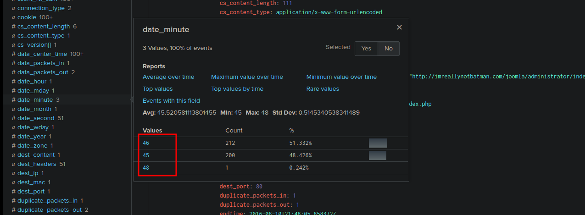
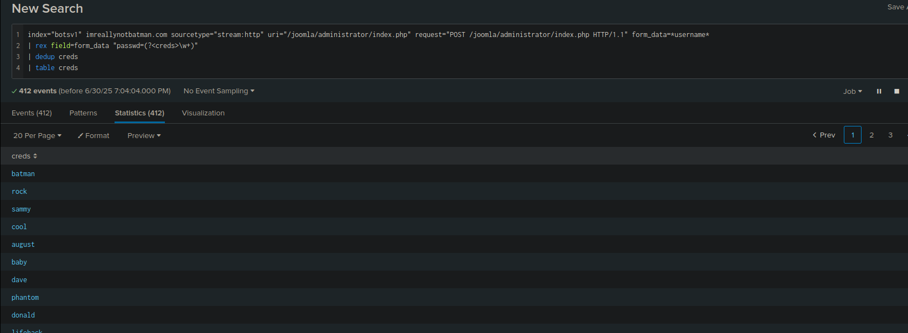

# Incident Handling Life Cycle: Investigating a Website Defacement at Wayne Enterprises

This guide outlines the incident handling process and details an investigation into a cyber attack on Wayne Enterprises, where attackers defaced the website `http://www.imreallynotbatman.com` with the message "YOUR SITE HAS BEEN DEFACED." The investigation uses Splunk as the SIEM solution to analyze logs from various sources (e.g., web server, firewall, Suricata, Sysmon) and maps the attacker’s activities to the Lockheed Martin Cyber Kill Chain phases. The analysis leverages Splunk Search Processing Language (SPL) queries and open-source intelligence (OSINT) to answer specific questions about the attack.

## Incident Handling Life Cycle

The incident handling process consists of four phases:

1. **Preparation**: Involves readiness activities such as documenting policies, implementing security controls (e.g., EDR, SIEM, IDS/IPS), and training staff.
2. **Detection and Analysis**: Focuses on detecting incidents via alerts from security tools and analyzing them to identify the root cause, including threat hunting for unknown threats.
3. **Containment, Eradication, and Recovery**: Involves isolating infected systems, removing infection traces, and restoring normal operations.
4. **Post-Incident Activity / Lessons Learned**: Identifies security gaps, updates detection rules, and improves staff training to prevent future attacks.

## Scenario

Wayne Enterprises experienced a cyber attack where attackers defaced their website `http://www.imreallynotbatman.com`. As a Security Analyst, the task is to investigate the attack using Splunk, which ingests logs from sources like Windows Event Logs (`wineventlog`), Sysmon (`XmlWinEventLog`), Fortinet Firewall (`fortigate_utm`), IIS web server (`iis`), Nessus scans (`Nessus:scan`), Suricata IDS (`suricata`), and network flows (`stream:http`, `stream:DNS`, `stream:icmp`). The goal is to map the attacker’s activities to the seven phases of the Cyber Kill Chain: Reconnaissance, Weaponization, Delivery, Exploitation, Installation, Command & Control, and Actions on Objectives.

## Log Sources

Key log sources used in the investigation:
- `wineventlog`: Windows Event Logs.
- `winRegistry`: Registry creation/modification/deletion logs.
- `XmlWinEventLog`: Sysmon logs for process and network activity.
- `fortigate_utm`: Fortinet Firewall logs.
- `iis`: IIS web server logs.
- `Nessus:scan`: Nessus vulnerability scan results.
- `suricata`: Suricata IDS alerts, critical for identifying attack triggers.
- `stream:http`: HTTP network traffic flows.
- `stream:DNS`: DNS network traffic flows.
- `stream:icmp`: ICMP network traffic flows.

## Investigation by Cyber Kill Chain Phases

### Reconnaissance
The attacker gathers information about the target, such as systems, web applications, or employees.

#### 1. CVE Value Associated with the Attack Attempt
**Question**: One Suricata alert highlighted the CVE value associated with the attack attempt. What is the CVE value?

**Search**: Queried `index=botsv1 sourcetype=suricata` to find alerts with CVE values.

**Finding**: The CVE value is `CVE-2014-6271` (Shellshock vulnerability).

**Answer**: `CVE-2014-6271`

#### 2. CMS of the Web Server
**Question**: What is the CMS our web server is using?

**Search**: Analyzed `index=botsv1 sourcetype=stream:http` logs, identifying a POST request referencing Joomla.

**Finding**: The content management system is `joomla`.

**Answer**: `joomla`

#### 3. Web Scanner Used by the Attacker
**Question**: What is the web scanner the attacker used to perform the scanning attempts?

**Search**: Checked `index=botsv1 sourcetype=stream:http` for user-agent strings in scan-related logs.

**Finding**: The attacker used `Acunetix` for web vulnerability scanning.

**Answer**: `Acunetix`

#### 4. IP Address of imreallynotbatman.com
**Question**: What is the IP address of the server imreallynotbatman.com?

**Search**: Queried `index=botsv1 sourcetype=stream:http` to identify the destination IP for `imreallynotbatman.com`.

**Finding**: The server IP is `192.168.250.70`.

**Answer**: `192.168.250.70`

### Exploitation
The attacker exploits vulnerabilities to gain access to the system.

#### 1. URI with Brute Force Attempts
**Question**: What was the URI which got multiple brute force attempts?

**Search**: Analyzed `index=botsv1 sourcetype=stream:http http_method=POST` for high-frequency URIs, identifying `/joomla/index.php/component/search/` and `/joomla/administrator/index.php`. The admin login page showed clear brute force signs.

**Finding**: The URI is `/joomla/administrator/index.php`.

**Answer**: `/joomla/administrator/index.php`

#### 2. Username Targeted in Brute Force
**Question**: Against which username was the brute force attempt made?

**Search**: Inspected `index=botsv1 sourcetype=stream:http http_method=POST uri="/joomla/administrator/index.php"` for `form_data` fields.

**Finding**: The username targeted is `admin`.

**Answer**: `admin`

#### 3. Correct Password for Admin Access
**Question**: What was the correct password for admin access to the content management system running imreallynotbatman.com?

**Search**: Compared `index=botsv1 sourcetype=stream:http http_method=POST uri="/joomla/administrator/index.php"` logs, noting most attempts originated from `40.80.148.42` (dates 45-46 in `date_minute`) but a successful login from `23.22.63.114` (date 48).

**Finding**: The correct password is `batman`, identified by the unique IP and timestamp.

**Answer**: `batman`

#### 4. Number of Unique Passwords Attempted
**Question**: How many unique passwords were attempted in the brute force attempt?

**Search**: Queried `index=botsv1 sourcetype=stream:http http_method=POST uri="/joomla/administrator/index.php" | stats dc(form_data)` to count distinct passwords.

**Finding**: 412 unique passwords were attempted.

**Answer**: 412

#### 5. IP Attempting Brute Force
**Question**: What IP address is likely attempting a brute force password attack against imreallynotbatman.com?

**Search**: Analyzed `index=botsv1 sourcetype=stream:http http_method=POST uri="/joomla/administrator/index.php" | stats count by src_ip`, identifying `23.22.63.114` as the primary source.

**Finding**: The IP is `23.22.63.114`.

**Answer**: `23.22.63.114`

#### 6. IP Used for Successful Admin Login
**Question**: After finding the correct password, which IP did the attacker use to log in to the admin panel?

**Search**: Filtered `index=botsv1 sourcetype=stream:http http_method=POST uri="/joomla/administrator/index.php"` for successful login events, noting `40.80.148.42`.

**Finding**: The successful login IP is `40.80.148.42`.

**Answer**: `40.80.148.42`

### Installation
The attacker installs a backdoor or application for persistence.

#### 1. MD5 Hash of 3791.exe
**Question**: What is the MD5 hash of the program 3791.exe?

**Search**: Queried `index=botsv1 sourcetype=XmlWinEventLog *3791.exe* MD5=*` to extract the hash.

**Finding**: The MD5 hash is `AAE3F5A29935E6ABCC2C2754D12A9AF0`.

**Answer**: `AAE3F5A29935E6ABCC2C2754D12A9AF0`

#### 2. User Executing 3791.exe
**Question**: Which user executed the program 3791.exe on the server?

**Search**: Used the same query `index=botsv1 sourcetype=XmlWinEventLog *3791.exe*` to identify the user.

**Finding**: The user is `NT AUTHORITY\IUSR`.

**Answer**: `NT AUTHORITY\IUSR`

#### 3. Other Name for 3791.exe
**Question**: What other name is associated with this file 3791.exe on VirusTotal?

**Search**: Searched the MD5 hash `AAE3F5A29935E6ABCC2C2754D12A9AF0` on VirusTotal.

**Finding**: The file is also named `ab.exe`.

**Answer**: `ab.exe`

### Actions on Objectives
The attacker achieves their goal, in this case, defacing the website.

#### 1. File that Defaced the Website
**Question**: What is the name of the file that defaced the imreallynotbatman.com website?

**Search**: Queried `index=botsv1 sourcetype=suricata src_ip=192.168.250.70 dest_ip=23.22.63.114` to find files downloaded to the web server, identifying `poisonivy-is-coming-for-you-batman.jpeg`.

**Finding**: The defacement file is `poisonivy-is-coming-for-you-batman.jpeg`.

**Answer**: `poisonivy-is-coming-for-you-batman.jpeg`

#### 2. Fortigate Rule for SQL Injection
**Question**: What is the name of the rule triggered during the SQL injection attempt from IP 40.80.148.42?

**Search**: Queried `index=botsv1 sourcetype=fortigate_utm src_ip=40.80.148.42 "sql"` to identify triggered rules.

**Finding**: The rule is `HTTP.URI.SQL.Injection`.

**Answer**: `HTTP.URI.SQL.Injection`

### Command and Control
The attacker uses a C2 server to maintain communication with the compromised system.

#### 1. FQDN Associated with the Attack
**Question**: This attack used dynamic DNS to resolve to the malicious IP. What fully qualified domain name (FQDN) is associated with this attack?

**Search**: Queried `index=botsv1 sourcetype=fortigate_utm "poisonivy-is-coming-for-you-batman.jpeg"` to extract the URL and FQDN from the `url` field.

**Finding**: The FQDN is `prankglassinebracket.jumpingcrab.com`.

**Answer**: `prankglassinebracket.jumpingcrab.com`

### Weaponization
The attacker creates malware, establishes domains, or sets up C2 infrastructure.

#### 1. IP Tied to Pre-Staged Domains
**Question**: What IP address has P01s0n1vy tied to domains that are pre-staged to attack Wayne Enterprises?

**Search**: Used OSINT (e.g., VirusTotal, ThreatCrowd) to analyze `prankglassinebracket.jumpingcrab.com`, confirming its resolution to `23.22.63.114`.

**Finding**: The IP is `23.22.63.114`.

**Answer**: `23.22.63.114`

#### 2. Email Address Associated with P01s0n1vy
**Question**: What is the email address most likely associated with the P01s0n1vy APT group?

**Search**: Performed a WHOIS lookup on `waynecorinc.com` and `po1s0n1vy.com` using Whoxy.com, identifying `lillian.rose@po1s0n1vy.com` as the registrant email.

**Finding**: The email is `lillian.rose@po1s0n1vy.com`.

**Answer**: `lillian.rose@po1s0n1vy.com`

## Splunk Configuration
- **Index**: `botsv1` contains logs from web server, firewall, Suricata, and Sysmon.
- **Search**: Used SPL queries in the Search & Reporting App to filter logs by `sourcetype`, `src_ip`, `dest_ip`, `uri`, and `form_data`.
- **OSINT**: Leveraged VirusTotal, ThreatCrowd, and Whoxy.com for external intelligence on IPs, domains, and email addresses.

## Cyber Kill Chain Mapping
- **Reconnaissance**: Used Acunetix to scan `imreallynotbatman.com` (Joomla CMS, IP `192.168.250.70`), targeting `CVE-2014-6271`.
- **Weaponization**: Created malware (`3791.exe`, aka `ab.exe`) and set up C2 via `prankglassinebracket.jumpingcrab.com` (`23.22.63.114`).
- **Delivery**: Attempted SQL injection (`HTTP.URI.SQL.Injection`) and brute force on `/joomla/administrator/index.php`.
- **Exploitation**: Successfully brute-forced the `admin` account with password `batman` from `23.22.63.114`, logging in from `40.80.148.42`.
- **Installation**: Installed `3791.exe` (MD5: `AAE3F5A29935E6ABCC2C2754D12A9AF0`) executed by `NT AUTHORITY\IUSR`.
- **Command & Control**: Communicated with `prankglassinebracket.jumpingcrab.com` to download `poisonivy-is-coming-for-you-batman.jpeg`.
- **Actions on Objectives**: Defaced the website with `poisonivy-is-coming-for-you-batman.jpeg`.

## Recommendations
- **Patch Vulnerabilities**: Apply patches for `CVE-2014-6271` on Joomla servers.
- **Block Malicious IPs**: Add `23.22.63.114` and `40.80.148.42` to firewall blocklists.
- **Monitor Domains**: Watch for connections to `prankglassinebracket.jumpingcrab.com` and `waynecorinc.com`.
- **Secure Admin Accounts**: Enforce strong passwords and MFA for Joomla admin accounts.
- **Remove Malware**: Delete `3791.exe` (`ab.exe`) and scan for persistence mechanisms.
- **Enh