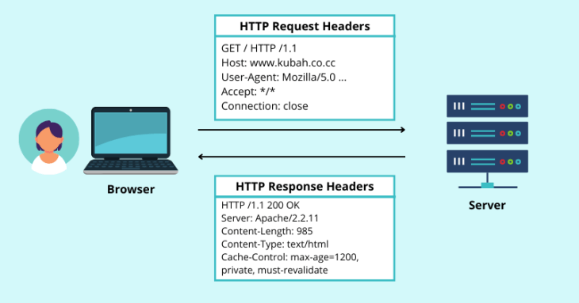

# HTTP Security Headers: In-Depth Guide

## Overview
HTTP security headers are response headers sent by a web server to instruct browsers on how to handle content securely, mitigating common web vulnerabilities like cross-site scripting (XSS), clickjacking, and man-in-the-middle (MITM) attacks. They act as a browser-enforced rulebook, controlling script execution, connection protocols, and resource access without altering application logic. However, not every missing header is a critical vulnerability, context matters. 

  

## How HTTP Security Headers Work
HTTP security headers are key-value pairs in HTTP responses (e.g., `Content-Security-Policy: default-src 'self'`). They’re processed by modern browsers to enforce security policies, such as restricting script sources or mandating HTTPS. Headers fall into two categories:
- **Strengthening Headers**: Enhance security when set (e.g., Content-Security-Policy, HSTS).
- **Weakening Headers**: May reduce security if misconfigured (e.g., permissive CORS).

### Why Context Matters
Many tutorials flag missing headers as vulnerabilities, but Google’s bug bounty program emphasizes impact over presence. A missing header isn’t inherently exploitable unless it enables a specific attack (e.g., XSS on a sensitive endpoint). Understanding functionality and risk is key to assessing severity.

## Key Security Headers

### 1. Content-Security-Policy (CSP)
- **Purpose**: Whitelists trusted sources for scripts, styles, images, and other resources, mitigating XSS and data injection.
- **Mechanics**: Defines allowed origins (e.g., `'self'`, `cdn.example.com`) and resource types (e.g., `script-src`, `style-src`). Browsers block non-compliant resources.
- **Example**:
  ```
  Content-Security-Policy: default-src 'self'; script-src 'self' cdn.example.com; object-src 'none'
  ```
  - Allows content from the same origin (`'self'`) and scripts from a trusted CDN.
  - Blocks `<object>` tags (e.g., Flash) entirely.
- **Why Not Always Critical?**: CSP prevents XSS exploitation but doesn’t fix underlying flaws. Missing CSP isn’t a vulnerability unless an XSS exists. Google’s CSP Evaluator flags missing `script-src` as high-severity, but without an XSS, it’s just defense-in-depth.
- **Best Practices**:
  - Start with `Content-Security-Policy-Report-Only` to log violations without blocking.
  - Use `'nonce-<random>'` or `'strict-dynamic'` for dynamic scripts.
  - Avoid broad directives like `unsafe-inline` or `*`.
  - Example: `script-src 'nonce-abc123' cdn.example.com` ensures only nonced scripts run.

  

### 2. HTTP Strict Transport Security (HSTS)
- **Purpose**: Forces browsers to use HTTPS, preventing HTTP connections vulnerable to MITM attacks.
- **Mechanics**: Instructs browsers to convert `http://` requests to `https://` for a specified duration (`max-age`). Includes `includeSubDomains` and `preload` options for broader enforcement.
- **Example**:
  ```
  Strict-Transport-Security: max-age=31536000; includeSubDomains; preload
  ```
  - Enforces HTTPS for 1 year, applies to subdomains, and opts into browser preload lists.
- **Why Not Always Critical?**: HSTS is ignored on HTTP connections (attackers can strip it). Modern browsers auto-upgrade to HTTPS (e.g., Chrome’s HTTPS-First mode), reducing HSTS’s necessity. Google notes internal HSTS efforts, so missing headers may be known issues.
- **Best Practices**:
  - Set `max-age` to at least 1 year (`31536000` seconds).
  - Use `includeSubDomains` for full coverage.
  - Register with HSTS preload lists (hstspreload.org) for first-visit protection.
  - Test via HTTPS first to avoid locking users out.

  

### 3. X-Frame-Options
- **Purpose**: Prevents clickjacking by controlling whether a page can be embedded in an `<iframe>`.
- **Mechanics**: Options include `DENY` (block all framing), `SAMEORIGIN` (allow same-origin framing), or `ALLOW-FROM <uri>` (specific origins).
- **Example**:
  ```
  X-Frame-Options: SAMEORIGIN
  ```
  - Allows framing only by pages on the same domain.
- **Why Not Always Critical?**: Clickjacking requires user interaction and sensitive actions (e.g., form submissions). On low-risk sites (e.g., static content), impact is minimal. Some sites (e.g., YouTube) intentionally allow framing for embeds, omitting this header by design.
- **Best Practices**:
  - Use `SAMEORIGIN` or `DENY` unless embedding is a feature.
  - Combine with CSP’s `frame-ancestors 'none'` for modern browsers.
  - Assess clickjacking impact (e.g., does the site have critical actions?).

  

### 4. Cross-Origin Resource Sharing (CORS)
- **Purpose**: Allows controlled cross-origin requests, relaxing the Same-Origin Policy (SOP) for APIs.
- **Mechanics**: Headers like `Access-Control-Allow-Origin` specify permitted origins, methods, and headers. `Access-Control-Allow-Credentials` includes cookies in requests.
- **Example**:
  ```
  Access-Control-Allow-Origin: https://app.example.com
  Access-Control-Allow-Methods: GET, POST
  Access-Control-Allow-Headers: Content-Type, Authorization
  Access-Control-Allow-Credentials: true
  ```
  - Allows requests from `app.example.com` with specific methods and headers, including cookies.
- **Why Not Always Critical?**: Permissive CORS (e.g., `*`) is only dangerous with cookie-based authentication, enabling CSRF-like attacks. Token-based auth (e.g., Authorization headers) is unaffected, as browsers don’t auto-include tokens. Open APIs (e.g., Google’s) intentionally use permissive CORS.
- **Best Practices**:
  - Specify exact origins (e.g., `https://app.example.com`) instead of `*`.
  - Avoid `Access-Control-Allow-Credentials: true` unless necessary.
  - Validate impact: Does CORS enable authenticated actions or data leaks?

  

### 5. X-Content-Type-Options
- **Purpose**: Prevents MIME-type sniffing, ensuring browsers respect the declared `Content-Type`.
- **Mechanics**: `nosniff` forces browsers to use the server’s `Content-Type` (e.g., `text/plain`) instead of guessing (e.g., executing a `.txt` file as JavaScript).
- **Example**:
  ```
  X-Content-Type-Options: nosniff
  ```
- **Why Not Always Critical?**: MIME sniffing is a niche attack vector, requiring specific conditions (e.g., mislabeled files with executable content). Modern browsers are stricter, reducing risk.
- **Best Practices**:
  - Always set `nosniff` to prevent edge cases.
  - Ensure correct `Content-Type` headers (e.g., `application/json` for JSON).

 

### 6. Referrer-Policy
- **Purpose**: Controls `Referer` header content to prevent leaking sensitive URL data (e.g., query parameters, tokens).
- **Mechanics**: Policies like `strict-origin-when-cross-origin` send full URLs for same-origin requests but only the domain for cross-origin.
- **Example**:
  ```
  Referrer-Policy: strict-origin-when-cross-origin
  ```
  - Sends `https://example.com` to external sites, not `https://example.com?token=abc123`.
- **Why Not Always Critical?**: Leaked referrers are a privacy concern but rarely enable direct attacks unless sensitive data (e.g., session tokens) is in URLs.
- **Best Practices**:
  - Use `strict-origin-when-cross-origin` or `no-referrer` for sensitive apps.
  - Avoid `unsafe-url`, which leaks full URLs.

  

### 7. Permissions-Policy
- **Purpose**: Restricts access to browser features (e.g., geolocation, camera) to prevent abuse by scripts.
- **Mechanics**: Specifies allowed origins for features (e.g., `geolocation=(self)`).
- **Example**:
  ```
  Permissions-Policy: geolocation=(self), camera=(), microphone=()
  ```
  - Allows geolocation for the same origin, blocks camera/microphone.
- **Why Not Always Critical?**: Feature abuse requires specific attack vectors (e.g., malicious widgets). Missing policies are low-impact unless sensitive features are exposed.
- **Best Practices**:
  - Disable unused features (e.g., `camera=()`).
  - Limit to trusted origins (e.g., `self`).

### 8. HTTPOnly Cookie Flag
- **Purpose**: Prevents JavaScript access to cookies, mitigating XSS-based cookie theft.
- **Mechanics**: Cookies with `HttpOnly` are only sent in HTTP requests, not accessible via `document.cookie`.
- **Example**:
  ```
  Set-Cookie: session=abc123; HttpOnly; Secure
  ```
- **Why Not Always Critical?**: HttpOnly doesn’t prevent XSS attacks; it only stops cookie theft. XSS can still send authenticated requests. Non-auth cookies (e.g., preferences) don’t need it.
- **Best Practices**:
  - Apply `HttpOnly` and `Secure` to session cookies.
  - Use token-based auth (e.g., JWT in headers) to reduce cookie reliance.

  

## Balancing Security and Hype
- **Why Not Every Missing Header is a Vulnerability**: Headers are defense-in-depth, not fixes. Missing CSP doesn’t cause XSS; it fails to block it. Google’s bug bounty program rejects reports without impact (e.g., missing HSTS on HTTP-only sites) because context determines severity.
- **Realistic Impact**: Assess the site’s functionality (e.g., critical actions for clickjacking, auth method for CORS). Low-risk sites (e.g., static pages) don’t need every header.
- **Overhyped Issues**: Tools like scanners flag missing headers without context, leading to false positives. YouTube’s lack of X-Frame-Options is intentional for embeds, not a flaw.
- **Developer Trade-offs**: Headers add security but consume resources. Fixing actual vulnerabilities (e.g., XSS) often outweighs adding every header.

## Best Practices Summary
- **Test Headers**: Use tools like `securityheaders.com` or Google’s CSP Evaluator to validate configurations.
- **Contextual Implementation**:
  - Critical apps (e.g., banking): Use all headers with strict policies.
  - Public APIs: Allow permissive CORS but secure auth (e.g., tokens).
  - Static sites: Prioritize HSTS, X-Content-Type-Options over CSP.
- **Avoid Wildcards**: Don’t use `*` in CORS or CSP; specify exact origins.
- **Monitor and Log**: Use report-only modes (e.g., CSP) to test without breaking functionality.
- **Combine Headers**: X-Frame-Options + CSP’s `frame-ancestors` for layered clickjacking protection.
- **Stay Updated**: Modern browsers evolve (e.g., HTTPS-First), reducing some headers’ necessity.

## Example Configuration (Nginx)
```
server {
  listen 443 ssl;
  server_name example.com;

  # SSL Configuration
  ssl_certificate /path/to/cert.pem;
  ssl_certificate_key /path/to/key.pem;

  # Security Headers
  add_header Content-Security-Policy "default-src 'self'; script-src 'self' cdn.example.com; object-src 'none';" always;
  add_header Strict-Transport-Security "max-age=31536000; includeSubDomains; preload" always;
  add_header X-Frame-Options "SAMEORIGIN" always;
  add_header X-Content-Type-Options "nosniff" always;
  add_header Referrer-Policy "strict-origin-when-cross-origin" always;
  add_header Permissions-Policy "geolocation=(self), camera=(), microphone=()" always;
  add_header Access-Control-Allow-Origin "https://app.example.com" always;
  add_header Access-Control-Allow-Methods "GET, POST" always;
  add_header Access-Control-Allow-Headers "Content-Type, Authorization" always;

  # Example Cookie
  set_cookie session=abc123; HttpOnly; Secure; SameSite=Strict;
}
```

## Disclaimer
Use HTTP security headers responsibly and test configurations to avoid breaking functionality. Misconfigurations may impact user experience or security. Always operate within legal and ethical boundaries.
