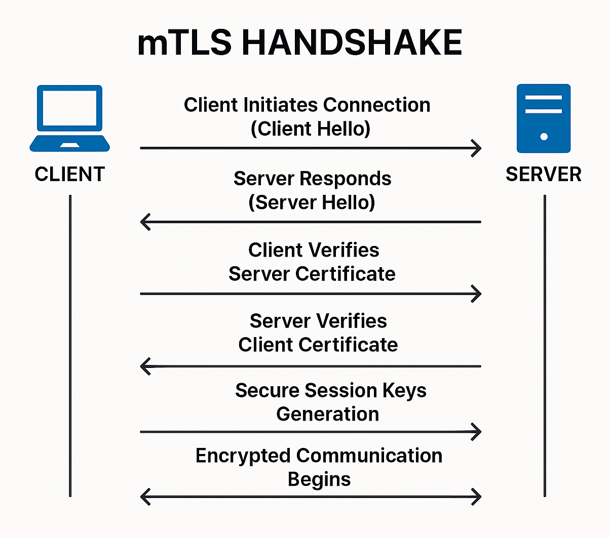
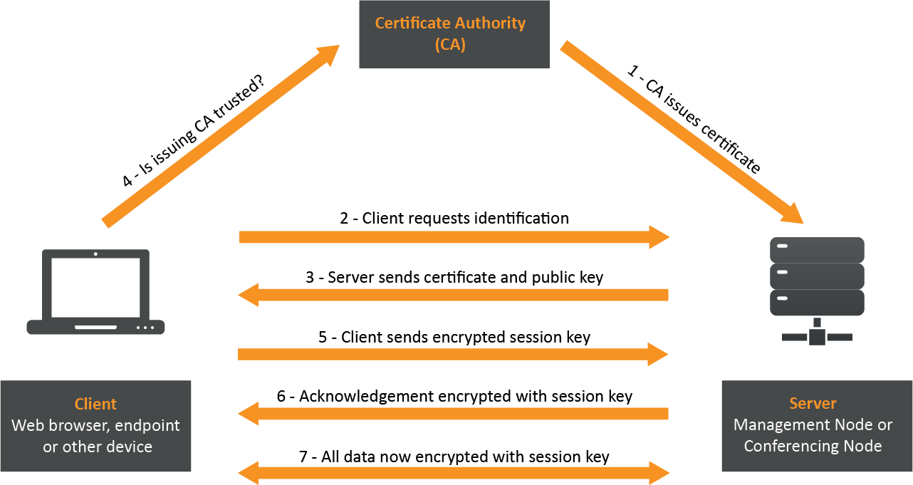
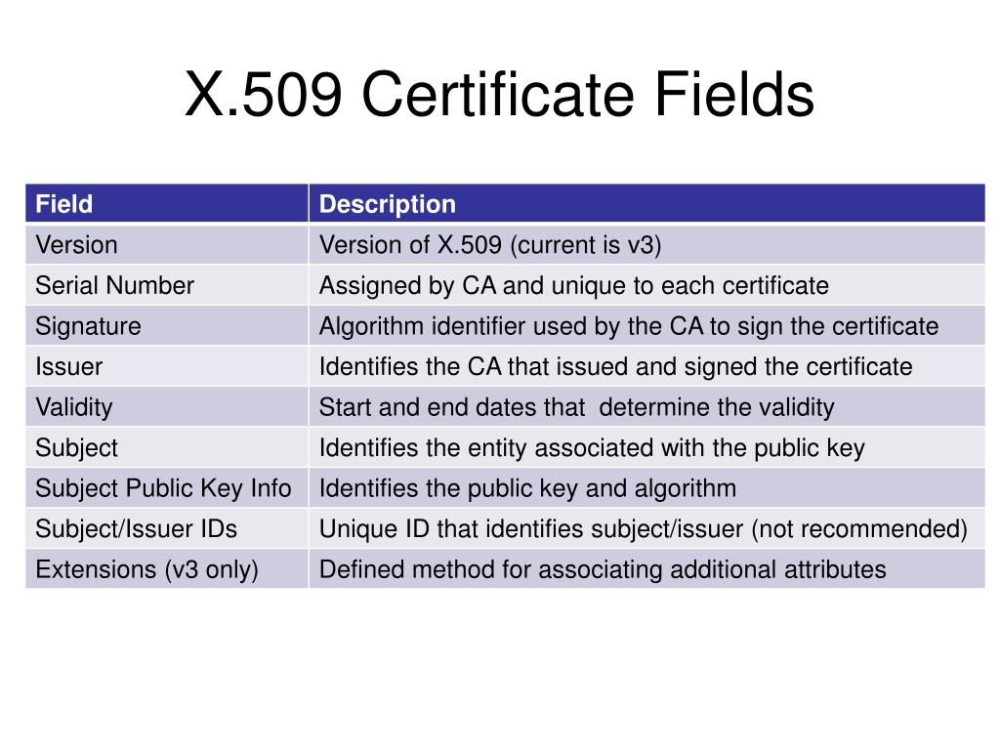
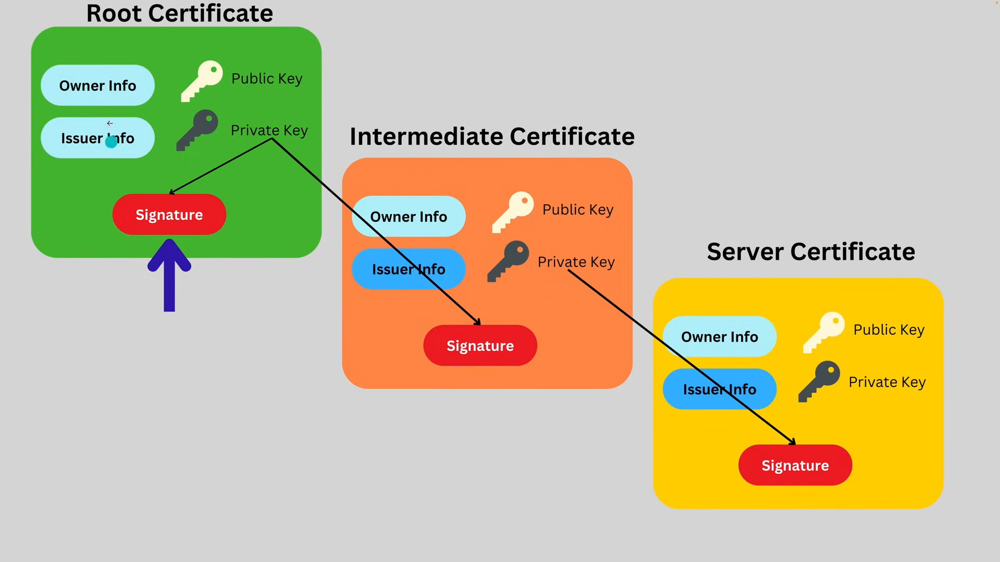

# SSL/TLS Certificates: 

## Overview
SSL/TLS certificates are digital documents that authenticate websites and enable encrypted connections via TLS (Transport Layer Security). They act as an "ID card" for the internet, verifying a server's identity and ensuring secure communication..

  


## How Certificates Work
Certificates are issued by Certificate Authorities (CAs) and used in the TLS handshake to establish trust.

### TLS Handshake Basics
1. **Client Hello**: Browser sends supported TLS versions and cipher suites to the server.
2. **Server Hello**: Server selects a cipher suite and sends its certificate (including public key).
3. **Verification**: Browser validates the certificate against trusted CAs.
4. **Key Exchange**: Browser uses the server's public key to encrypt a session key (e.g., via RSA or Diffie-Hellman).
5. **Secure Session**: Symmetric encryption (e.g., AES) is used for data exchange.

Certificates ensure the browser connects to the real server, not a spoofed one, by proving ownership of the private key corresponding to the public key in the certificate.

### Why Certificates Are Essential
- **Trust Foundation**: Without certificates, anyone could impersonate a site (e.g., a phishing site using a stolen certificate).
- **Encryption Enablement**: Public keys in certificates facilitate secure key exchange for symmetric encryption.
- **Global Impact**: A CA compromise (e.g., private key leak) could invalidate trust for millions of sites, as seen in past incidents like DigiNotar (2011).

  


## Certificate Fields
Certificates follow the X.509 standard, containing fields that define their validity and usage. Here's a breakdown of key fields:

| Field | Description | Example from twitter.com |
|-------|-------------|--------------------------|
| **Version** | Certificate format version (v3 allows extensions). | v3 |
| **Serial Number** | Unique ID assigned by the CA. | Unique hex string (e.g., 0x...FFAC). |
| **Signature Algorithm** | Algorithm used to sign the certificate (e.g., RSA with SHA-256). | sha256WithRSAEncryption |
| **Issuer** | CA that issued the certificate. | DigiCert TLS RSA SHA256 2020 CA1 |
| **Validity** | Not Before/After dates (certificate expires after ~1 year to limit compromise risk). | Not Before: Jan 10, 2022; Not After: Jan 9, 2023 |
| **Subject** | Entity the certificate is for (e.g., domain). | twitter.com |
| **Public Key** | Server's public key (e.g., RSA modulus and exponent). | RSA 2048-bit key |
| **Extensions** | Additional attributes (e.g., SAN for multiple domains, CRL/OCSP for revocation). | SAN: twitter.com, www.twitter.com; CRL Distribution Points |

Extensions are crucial in v3 certificates:
- **Subject Alternative Name (SAN)**: Allows multiple domains (e.g., `twitter.com`, `www.twitter.com`) or wildcards (e.g., `*.twitter.com` for subdomains).
- **Basic Constraints**: Specifies if the certificate can sign others (e.g., `CA:FALSE` for end-entity certificates).
- **CRL Distribution Points**: URLs for revocation lists.
- **Authority Information Access (AIA)**: Includes OCSP responder URLs.
- **Certificate Transparency (SCTs)**: Signed timestamps proving logging.

  


## Chain of Trust
Certificates form a chain linking the server certificate to a trusted root CA.

- **Root CA**: Self-signed, pre-trusted by browsers/OS (e.g., DigiCert Global Root CA). Stored in the system's trust store.
- **Intermediate CA**: Signed by root CA, delegates issuance to reduce root key exposure (e.g., DigiCert TLS RSA SHA256 2020 CA1 signs twitter.com).
- **Server Certificate**: Signed by intermediate CA, verifies the site's identity.

### How Chain Validation Works
1. Browser receives server certificate.
2. Verifies signature against intermediate CA's public key.
3. Verifies intermediate CA against root CA's public key.
4. If the root is trusted, the chain is valid.

Chain compromise (e.g., intermediate CA key leak) affects all downstream certificates, but revocation limits damage.

  

## Revocation
Certificates can be revoked before expiration if compromised (e.g., private key leak). Two main methods: CRL and OCSP.

### Certificate Revocation List (CRL)
- **How It Works**: CAs publish signed lists of revoked certificate serial numbers. Browsers download the CRL (from URLs in certificate's CRL Distribution Points extension) and check if the certificate's serial is listed.
- **Pros**: Offline check possible after download.
- **Cons**: CRLs can be large (millions of entries), causing delays. Browsers prefer OCSP for efficiency.

### Online Certificate Status Protocol (OCSP)
- **How It Works**: Browsers query the CA's OCSP responder (URL in certificate's AIA extension) for the certificate's status (good, revoked, or unknown). Responder returns a signed response.
- **Pros**: Real-time, lightweight (single certificate check).
- **Cons**: Privacy risk (reveals browsing history to CA), potential downtime if responder fails.

### OCSP Stapling
- **How It Works**: Server "staples" a time-stamped OCSP response to the certificate during handshake, reducing browser queries to CA.
- **Pros**: Faster, improves privacy (no direct browser-CA contact).
- **Cons**: Requires server support; stapled response has limited validity (e.g., 7 days).

Browsers prefer OCSP over CRL for speed, but CRL is still used for bulk revocation checks.

## Certificate Transparency (CT)
CT is a system requiring CAs to log all issued certificates publicly, enabling detection of misissued or spoofed certificates.

- **How It Works**: CAs submit certificates to CT logs (append-only ledgers). Browsers require Signed Certificate Timestamps (SCTs) in certificates, proving logging. Logs are monitored for anomalies (e.g., fake certificates for twitter.com).
- **SCTs**: Signed promises from logs that the certificate was added. Certificates include 2-3 SCTs from different logs.
- **Pros**: Detects rogue CAs or misissuance (e.g., spoofed david-bombal.com).
- **Cons**: Logs are public, potentially exposing domain info; not all CAs comply perfectly.

Use tools like `crt.sh` to search CT logs for domain history (e.g., twitter.com since 2017 vs. a spoofed domain from 2025).

## Examples
### Inspect Certificate with OpenSSL
Inspect twitter.com's certificate:
```bash
echo | openssl s_client -connect twitter.com:443 | openssl x509 -noout -text
```
- **Output Excerpt**:
  ```
  Certificate:
      Data:
          Version: 3 (0x2)
          Serial Number: ...
          Signature Algorithm: sha256WithRSAEncryption
          Issuer: C=US, O=DigiCert Inc, CN=DigiCert TLS RSA SHA256 2020 CA1
          Validity
              Not Before: Jan 10 00:00:00 2022 GMT
              Not After : Jan 9 23:59:59 2023 GMT
          Subject: C=US, ST=California, L=San Francisco, O=Twitter Inc, CN=twitter.com
          Subject Public Key Info:
              Public Key Algorithm: rsaEncryption
                  Public-Key: (2048 bit)
                  Modulus: ...
                  Exponent: 65537 (0x10001)
          X509v3 extensions:
              X509v3 Subject Alternative Name: 
                  DNS:twitter.com, DNS:www.twitter.com
              X509v3 Certificate Policies: ...
              X509v3 CRL Distribution Points: ...
              Authority Information Access: 
                  OCSP - URI:http://ocsp.digicert.com
              X509v3 Basic Constraints: 
                  CA:FALSE
              CT Precertificate SCTs: ...
  ```

### Check Domain History with CT (crt.sh)
Search for `twitter.com` on [crt.sh](https://crt.sh/) to see certificate history since 2017, detecting spoofs (e.g., a new `twitter-1.com` certificate).

