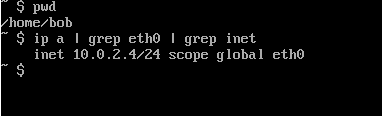
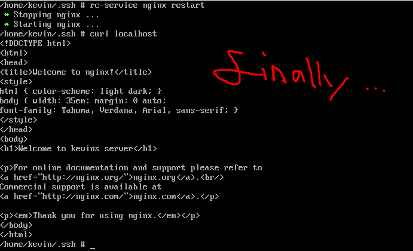

# SSH Tunneling: Secure Access to Remote Resources

## Overview
SSH (Secure Shell) is a protocol for establishing encrypted connections between a local machine (e.g., your laptop) and a remote server, typically over port 22. Beyond basic remote access, SSH tunneling (or port forwarding) enables secure access to applications running on other ports or servers, bypassing network restrictions like firewalls or Network Address Translation (NAT). 

  


## What is SSH Tunneling?
SSH tunneling creates a secure "tunnel" through an SSH connection (port 22) to forward traffic for other protocols (e.g., HTTP on port 80, RDP on port 3389) or to access servers without public IPs. It encrypts traffic, making it ideal for bypassing blocked ports or accessing internal resources securely. For example:
- Access a web server (port 80) on a remote server with only port 22 open.
- Reach a private server behind a NAT via a public-facing "jump host" (bastion).
- Proxy arbitrary traffic through a SOCKS proxy for flexible access.

### Why Use SSH Tunneling?
- **Security**: Encrypts traffic, unlike unencrypted protocols (e.g., clear RDP).
- **Bypasses Restrictions**: Accesses blocked ports or internal servers without firewall changes.
- **Flexibility**: Supports various protocols and network configurations.
- **Context Matters**: Tunneling enhances security but doesn’t fix underlying vulnerabilities (e.g., weak server authentication). As Google’s Vulnerability Rewards Program emphasizes, assess findings for exploitable impact.

## Types of SSH Tunneling

### 1. Local Port Forwarding
- **Purpose**: Forwards a local port to a remote server’s port via an SSH connection, allowing access to applications on the remote server (or beyond) as if they were local.
- **Use Case**: Access a web server (port 80) on a remote server with only port 22 open.
- **Mechanics**:
  - Local machine binds a port (e.g., `localhost:8888`).
  - Traffic to this port is tunneled over SSH (port 22) to the remote server’s specified port (e.g., `localhost:80` on the server).
- **Example**:
  ```bash
  ssh -N -L 8888:localhost:80 user@<remote-server-ip>
  ```
  - `-N`: Don’t execute a remote command; only forward ports.
  - `-L 8888:localhost:80`: Bind local port `8888` to `localhost:80` on the remote server.
  - Access `localhost:8888` in a browser to see the remote web server.
- **Scenario**: Your workplace blocks port 80, but the remote server has port 22 open. Tunnel HTTP traffic to access the web server securely.

  

### 2. Reverse Port Forwarding
- **Purpose**: Allows a remote server to access a port on your local machine or internal network, initiated from the internal machine (behind NAT).
- **Use Case**: Enable a third-party server to access an internal web server (port 80) on a private network without public IPs or firewall changes.
- **Mechanics**:
  - The internal machine (e.g., `ssh-server`) initiates an SSH tunnel to a remote server with a public IP.
  - The remote server binds a port (e.g., `8888`), which tunnels traffic back to a specified port (e.g., `localhost:80` on `ssh-server` or another internal server).
- **Example**:
  ```bash
  ssh -N -R 8888:localhost:80 ubuntu@<remote-server-public-ip>
  ```
  - `-R 8888:localhost:80`: Remote server binds port `8888`, forwarding traffic to `localhost:80` on `ssh-server`.
  - On the remote server, `curl localhost:8888` accesses the Nginx web server on `ssh-server`.
- **Extended Example** (accessing a private server):
  ```bash
  ssh -N -R 8888:10.0.1.216:80 ubuntu@<remote-server-public-ip>
  ```
  - Forwards `remote-server:8888` to `10.0.1.216:80` (a private server, `server1`) via `ssh-server`.
  - Requires `server1` to allow HTTP traffic from `ssh-server` (not via SSH).
- **Scenario**: Your internal server (`server1`) is behind NAT with no public IP. Use `ssh-server` to initiate a tunnel to a public remote server, allowing access to `server1`’s web server.

  

### 3. Dynamic Port Forwarding (SOCKS Proxy)
- **Purpose**: Creates a SOCKS proxy server on a local port, allowing flexible tunneling of arbitrary traffic to any destination via the SSH server, without specifying fixed ports.
- **Use Case**: Proxy browser or application traffic through a remote server to access the internet or internal resources as if originating from the remote server.
- **Mechanics**:
  - Local machine binds a port (e.g., `8888`) as a SOCKS proxy (v4/v5).
  - Applications configured to use this proxy send traffic through the SSH tunnel to the remote server, which forwards it to the final destination.
- **Example**:
  ```bash
  ssh -N -D 8888 ubuntu@<remote-server-public-ip>
  ```
  - `-D 8888`: Binds `localhost:8888` as a SOCKS proxy.
  - Configure an application (e.g., Firefox) to use `socks5://localhost:8888`.
  - Example: `curl --proxy socks5://localhost:8888 ifconfig.me` returns the remote server’s public IP.
- **Scenario**: Access the internet or internal servers from your laptop via a remote server, hiding your IP or bypassing NAT restrictions.


*Diagram showing SOCKS proxy traffic from laptop to remote server and beyond.*

## Key Differences
| **Type**            | **Direction**                          | **Initiator**         | **Use Case**                                                                 | **Scalability**                     |
|---------------------|----------------------------------------|-----------------------|------------------------------------------------------------------------------|-------------------------------------|
| **Local**           | Local → Remote                        | Local machine         | Access remote server’s apps (e.g., web server on port 80) via SSH.           | Static; requires specific ports.    |
| **Reverse**         | Remote → Local/Internal               | Internal machine      | Allow remote access to internal resources (e.g., private server behind NAT). | Static; requires specific ports.    |
| **Dynamic**         | Local → Any destination via Remote    | Local machine         | Proxy arbitrary traffic (e.g., browser, apps) through a remote server.       | Dynamic; no need to specify ports.  |

- **Local**: You initiate from your laptop to access a remote server’s service (e.g., Nginx on `server1`).
- **Reverse**: An internal server initiates to allow a remote server to access its services (e.g., `ssh-server` or `server1` behind NAT).
- **Dynamic**: You initiate a SOCKS proxy to route any traffic through a remote server, ideal for flexible or unknown destinations.

## Local Port Forwarding Example: Alpine Servers
This example demonstrates setting up local port forwarding between two Alpine Linux servers, `bob` (local machine) and `kevin` (remote server with Nginx), to access a web server on `kevin` via an SSH tunnel.

  

  


### Setup Steps
1. **Generate SSH Key Pair on `bob`**:
   - On `bob`, run:
     ```bash
     ssh-keygen
     ```
     - Creates `~/.ssh/id_rsa` (private) and `~/.ssh/id_rsa.pub` (public).
     - Press Enter to accept defaults (no passphrase for simplicity).
   - Result: Key pair generated.
       
  

2. **Copy Public Key to `kevin`**:
   - Copy `id_rsa.pub` from `bob` to `kevin`’s `~/.ssh/authorized_keys`:
     ```bash
     scp ~/.ssh/id_rsa.pub user@<kevin-ip>:~/.ssh/authorized_keys
     ```
     - Ensure `kevin` has `~/.ssh` with `chmod 700 ~/.ssh` and `authorized_keys` with `chmod 600 ~/.ssh/authorized_keys`.
   - Result: Key copied successfully.
       
     

3. **Configure SSH on `kevin` for Public Key Authentication**:
   - Edit `/etc/ssh/sshd_config` on `kevin`:
     ```bash
     vi /etc/ssh/sshd_config
     ```
     - Set `PubkeyAuthentication yes` and `PasswordAuthentication no` to enforce key-based authentication.
     - Restart SSH service:
       ```bash
       rc-service sshd restart
       ```
   - Result: SSH configured for secure key-based access.
       
    
       
     

4. **Install and Configure Nginx on `kevin`**:
   - Install Nginx:
     ```bash
     apk add nginx
     rc-service nginx start
     rc-update add nginx
     ```
   - Test locally: `curl localhost:80` should return Nginx’s default page.
   - **Troubleshooting 404 Error**:
     - If `curl localhost:80` returns a 404, check Nginx configuration:
       ```bash
       vi /etc/nginx/http.d/default.conf
       ```
       - Ensure the `root` directive points to a valid directory (e.g., `/var/lib/nginx/html`).
       - Verify the directory exists and has an `index.html` file:
         ```bash
         ls -l /var/lib/nginx/html
         ```
       - Restart Nginx:
         ```bash
         sudo rc-service nginx restart
         ```
     - Result: Nginx serves the default page.
         
       
         
     
         
       
         
     
         
       

5. **Create Local Port Forwarding Tunnel from `bob`**:
   - On `bob`, run:
     ```bash
     ssh -f -N -L 8888:localhost:80 user@<kevin-ip>
     ```
     - Binds `localhost:8888` on `bob` to `localhost:80` on `kevin`.
     - Curl `localhost:8888` on `bob` to see Nginx’s page.
   - **Troubleshooting SSH Error**:
     - If the tunnel fails (e.g., connection refused), check:
       - SSH service is running on `kevin`: `sudo rc-service sshd status`.
       - Correct user and IP in the SSH command.
     - Result: Tunnel established successfully.
         
      
         
      
         
       

