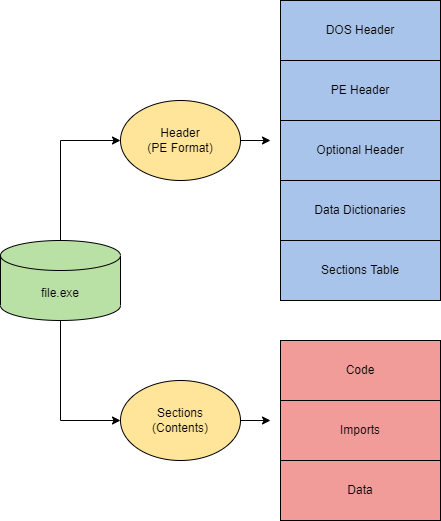

# Windows Internals

## Overview
Windows Internals encompasses the core mechanisms that power the Windows operating system, including processes, threads, virtual memory, Dynamic-Link Libraries (DLLs), the Portable Executable (PE) format, and the Windows API. 


## Processes
A process represents the execution of a program, serving as a container for resources needed to run an application. Each process includes a virtual address space, executable code, system resource handles, a security context, a unique process identifier (PID), environment variables, priority class, and at least one thread. Processes are fundamental to Windows, as most system functionality (e.g., Microsoft Defender, keyboard/mouse input) is driven by applications with corresponding processes.

### Examples of Default Windows Processes
- **MsMpEng.exe**: Microsoft Defender antivirus service.
- **wininit.exe**: Initializes keyboard, mouse, and system services.
- **lsass.exe**: Manages credential storage and authentication.

### Process Components
| Component | Purpose |
|-----------|---------|
| **Private Virtual Address Space** | Allocates virtual memory addresses for the process. |
| **Executable Program** | Defines code and data stored in the virtual address space. |
| **Open Handles** | Manages access to system resources (e.g., files, registry). |
| **Security Context** | Access token defining user, groups, and privileges. |
| **Process ID (PID)** | Unique numerical identifier for the process. |
| **Threads** | Units of execution within the process. |

### Processes in Memory
At a lower level, a process resides in its virtual address space with the following components:

| Component | Purpose |
|-----------|---------|
| **Code** | Executable instructions for the process. |
| **Global Variables** | Stored variables accessible across the process. |
| **Process Heap** | Dynamic memory allocation for data. |
| **Process Resources** | Additional resources (e.g., handles, configurations). |
| **Environment Block** | Data structure with process metadata (e.g., environment variables). |

  


### Observing Processes
Use **Windows Task Manager** or advanced tools like **Process Hacker 2**, **Process Explorer**, or **Procmon** to inspect processes. Key details include:

| Value | Purpose | Example |
|-------|---------|---------|
| **Name** | Name of the process (from application). | `conhost.exe` |
| **PID** | Unique identifier. | `7408` |
| **Status** | Current state (e.g., Running, Suspended). | `Running` |
| **User Name** | User account running the process (indicates privilege). | `SYSTEM` |

### Attack Vectors
Attackers target processes to evade detection or execute malicious code:
- **Process Injection (T1055)**: Injecting code into a legitimate process's memory.
- **Process Hollowing (T1055.012)**: Replacing a process’s code with malicious code while retaining its identity.
- **Process Masquerading (T1055.013)**: Disguising malware as a legitimate process (e.g., naming it `svchost.exe`).

## Threads
A thread is the smallest unit of execution within a process, controlling how a process runs. Each process has at least one thread, but multi-threaded applications (e.g., web browsers) use multiple threads for tasks like rendering or I/O operations. Threads share the parent process’s resources (code, global variables, heap) but maintain unique data.

### Thread Components
| Component | Purpose |
|-----------|---------|
| **Stack** | Stores thread-specific data (e.g., procedure calls, exceptions). |
| **Thread Local Storage (TLS)** | Allocates unique data for the thread. |
| **Stack Argument** | Unique value for thread initialization. |
| **Context Structure** | Holds CPU register values managed by the kernel. |

### Thread Abuse
Threads are prime targets for attackers due to their role in execution:
- **Code Execution**: Injecting malicious code into a thread’s context.
- **Chaining Attacks**: Combining thread manipulation with API calls for techniques like process injection.


## Virtual Memory
Virtual memory abstracts physical memory, providing each process a private virtual address space. The **memory manager** translates virtual addresses to physical ones, preventing collisions between applications.

- **32-bit Systems**: Maximum 4 GB virtual address space, split into:
  - **User Space**: 0x00000000–0x7FFFFFFF (processes).
  - **Kernel Space**: 0x80000000–0xFFFFFFFF (OS).
- **64-bit Systems**: Maximum 256 TB, maintaining the same user/kernel split ratio.
- **Paging**: When virtual memory exceeds physical memory, the memory manager pages data to disk (swap file).
- **Tuning**: Use `increaseUserVA` or **Address Windowing Extensions (AWE)** for applications that are 32-bit and are in need of larger address spaces.
  


## Dynamic-Link Libraries (DLLs)
DLLs are shared libraries containing code and data used by multiple programs, promoting modularity, code reuse, and efficient memory/disk usage. They are loaded into a process’s virtual address space as dependencies.

### DLL Loading
- **Load-Time Dynamic Linking**: Explicit calls to DLL functions using header (`.h`) and import library (`.lib`) files.
  ```c
  #include "sampleDLL.h"
  int APIENTRY WinMain(HINSTANCE hInstance, HINSTANCE hPrevInstance, LPSTR lpCmdLine, int nCmdShow) {
      HelloWorld(); // Calls DLL function
      return 0;
  }
  ```
- **Run-Time Dynamic Linking**: Loads DLL at runtime using `LoadLibrary` and `GetProcAddress`.
  ```c
  typedef VOID (*DLLPROC)(LPTSTR);
  HINSTANCE hinstDLL = LoadLibrary("sampleDLL.dll");
  if (hinstDLL != NULL) {
      DLLPROC HelloWorld = (DLLPROC)GetProcAddress(hinstDLL, "HelloWorld");
      if (HelloWorld != NULL) HelloWorld();
      FreeLibrary(hinstDLL);
  }
  ```

### Attack Vectors
- **DLL Hijacking (T1574.001)**: Placing a malicious DLL in a directory searched by the application.
- **DLL Side-Loading (T1574.002)**: Loading a malicious DLL alongside a legitimate one.
- **DLL Injection (T1055.001)**: Injecting a malicious DLL into a process’s memory.

## Portable Executable (PE) Format
The PE format defines how executables (`.exe`) and object files (e.g., DLLs) are structured, including code, data, and metadata. It uses the PE and Common Object File Format (COFF) specifications.

### PE Components
| Component | Purpose |
|-----------|---------|
| **DOS Header** | Identifies the file as `.exe` (starts with `MZ`). |
| **DOS Stub** | Prints "This program cannot be run in DOS mode." |
| **PE File Header** | Defines file format, signature, and headers. |
| **Image Optional Header** | Includes metadata like entry point and data directories. |
| **Data Dictionaries** | Points to data directory structures (e.g., imports, exports). |
| **Section Table** | Defines sections like `.text` (code), `.data` (variables), `.rdata` (imports), `.rsrc` (resources), `.reloc` (relocations), `.debug` (debug info). |

### Example: `calc.exe` Hex Dump
```
Offset(h) 00 01 02 03 04 05 06 07 08 09 0A 0B 0C 0D 0E 0F
00000000  4D 5A 90 00 03 00 00 00 04 00 00 00 FF FF 00 00  MZ..........ÿÿ..
00000040  0E 1F BA 0E 00 B4 09 CD 21 B8 01 4C CD 21 54 68  ..º..´.Í!¸.LÍ!Th
00000050  69 73 20 70 72 6F 67 72 61 6D 20 63 61 6E 6E 6F  is program canno
000000E0  00 00 00 00 00 00 00 00 50 45 00 00 64 86 06 00  ........PE..d†..
000001F0  2E 74 65 78 74 00 00 00 D0 0B 00 00 00 10 00 00  .text...Ð.......
00000210  2E 72 64 61 74 61 00 00 76 0C 00 00 00 20 00 00  .rdata..v.......
00000240  2E 64 61 74 61 00 00 00 B8 06 00 00 00 30 00 00  .data...¸....0..
```

  


## Windows API and Kernel Interaction
The Windows API (Win32/Win64) provides interfaces to interact with processes, threads, memory, and hardware. The kernel manages all programs and bridges software-hardware interactions, switching between **user mode** (isolated, no direct hardware access) and **kernel mode** (full hardware access).

### User vs. Kernel Mode
| Mode | Characteristics |
|------|-----------------|
| **User Mode** | No direct hardware access; runs in private virtual address space; access to owned memory only. |
| **Kernel Mode** | Direct hardware access; runs in shared virtual address space; access to all physical memory. |

### Mode Switching
Applications start in user mode and switch to kernel mode via system calls or API calls (e.g., `OpenProcess`, `VirtualAllocEx`). Languages like C# route through a runtime (e.g., CLR) before reaching the Win32 API.

  


