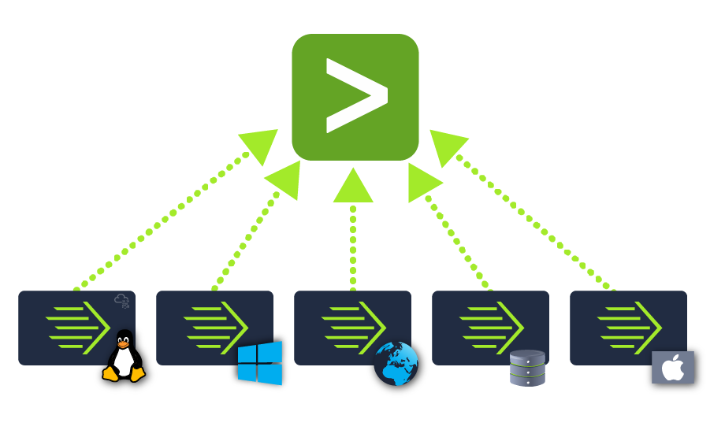
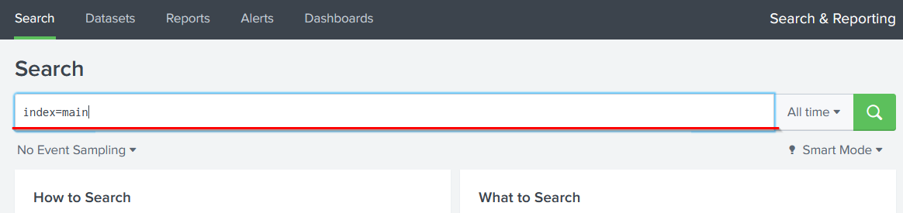

# Splunk: Basics

## Splunk Components

Splunk consists of three main components: Forwarder, Indexer, and Search Head.


### Splunk Forwarder
The Splunk Forwarder is a lightweight agent installed on monitored endpoints to collect and send data to a Splunk instance. It uses minimal resources, ensuring low performance impact. Key data sources include:
- Web server traffic logs.
- Windows Event Logs, PowerShell, and Sysmon data.
- Linux host-centric logs.
- Database connection requests, responses, and errors.



### Splunk Indexer
The Splunk Indexer processes data received from forwarders, normalizing it into field-value pairs, determining data types, and storing it as searchable events.


### Splunk Search Head
The Search Head, within the Search & Reporting App, allows users to search indexed logs using Splunk Search Processing Language (SPL). Search results are returned as field-value pairs and can be visualized as tables, pie charts, bar charts, or column charts.




## Splunk Interface

### Splunk Home Screen
The default Splunk home screen provides access to key functionalities.


### Splunk Bar
The top panel, known as the Splunk Bar, includes:
- **Messages**: System-level notifications.
- **Settings**: Configure the Splunk instance.
- **Activity**: Review job progress.
- **Help**: Access tutorials and documentation.
- **Find**: Search feature.
- **App Switching**: Switch between installed Splunk apps.


### Explore Splunk
The Explore Splunk panel offers quick links to:
- Add data to the Splunk instance.
- Install new Splunk apps.
- Access Splunk documentation.


### Data Ingestion
Splunk can ingest various data sources, such as event logs, website logs, and firewall logs, which are processed into individual events. Data sources are categorized as follows:


## Practical Analysis: VPN Logs

The provided VPN log data was uploaded to Splunk and indexed under `VPN_Logs`. The following questions were answered using SPL queries in the Search & Reporting App.

### 1. Number of Events in the Log File
**Question**: How many events are present in the log file?

**Search**: Queried the `VPN_Logs` index without filters to count all events.

**Finding**: 2862 events were returned.


**Answer**: 2862 events.

### 2. Log Events by User Maleena
**Question**: How many log events by the user Maleena are captured?

**Search**: Used SPL query:
```
index=VPN_Logs UserName="Maleena"
```

**Finding**: 60 events were captured for user Maleena.


**Answer**: 60 events.

### 3. Name Associated with IP 107.14.182.38
**Question**: What is the name associated with IP 107.14.182.38?

**Search**: Used SPL query:
```
index=VPN_Logs Source_ip="107.14.182.38"
```

**Finding**: The name associated with the IP is `smith`.


**Answer**: The name is `smith`.

### 4. Events from All Countries Except France
**Question**: What is the number of events that originated from all countries except France?

**Search**: Used SPL query:
```
index=VPN_Logs Source_Country != "France"
```

**Finding**: 2814 events originated from countries other than France.


**Answer**: 2814 events.

### 5. VPN Events by IP 107.3.206.58
**Question**: How many VPN Events were observed by the IP 107.3.206.58?

**Search**: Used SPL query:
```
index=VPN_Logs Source_ip="107.3.206.58"
```

**Finding**: 14 events were observed for the IP.


**Answer**: 14 events.


## Documentation
- Splunk Documentation: [docs.splunk.com](https://docs.splunk.com)
- SPL Reference: [docs.splunk.com/Documentation/Splunk/9.0.0/SearchReference](https://docs.splunk.com/Documentation/Splunk/9.0.0/SearchReference)


