# Understanding Core Windows Processes for Endpoint Security

## The System Process (PID 4)

### What Does the System Process Do?

As defined in *Windows Internals, 6th Edition*:

> "The System process (process ID 4) is the home for a special kind of thread that runs only in kernel mode—a kernel-mode system thread. System threads have all the attributes and contexts of regular user-mode threads (such as a hardware context, priority, and so on) but are different in that they run only in kernel-mode executing code loaded in system space, whether that is in Ntoskrnl.exe or in any other loaded device driver. In addition, system threads don't have a user process address space and hence must allocate any dynamic storage from operating system memory heaps, such as a paged or nonpaged pool."

The **System** process is unique:
- **Fixed PID**: Always PID 4, unlike other processes with random PIDs.
- **Kernel-Mode Only**: Executes code in `Ntoskrnl.exe` (NT OS Kernel) or device drivers, handling low-level tasks like memory management and I/O operations.
- **No User Address Space**: Allocates memory from system pools, not user-mode virtual spaces.

### User Mode vs. Kernel Mode

Windows operates in two modes:
- **User Mode**: Applications run in isolated virtual address spaces, preventing interference with other processes or the OS. Crashes are contained.
- **Kernel Mode**: OS components and drivers share a single address space. Errors can corrupt system data or crash the OS.

The System process runs exclusively in **kernel mode**, making it a critical target for attackers seeking elevated privileges.

**Screenshot**:
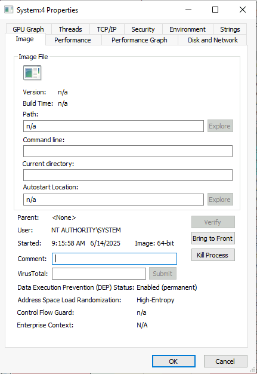

### Normal Behavior

Using **Process Explorer** or **Process Hacker**, normal properties include:
- **Image Path**:
  - Process Explorer: N/A (kernel-hosted, no specific executable).
  - Process Hacker: `C:\Windows\System32\ntoskrnl.exe` (NT OS Kernel).
- **Parent Process**:
  - Process Explorer: None.
  - Process Hacker: System Idle Process (PID 0).
- **Number of Instances**: One.
- **User Account**: Local System.
- **Start Time**: At boot time.
- **PID**: 4.
- **Session**: Session 0 (isolated system session).
- **Verification**: Process Hacker shows “Verified” as Microsoft Windows.

**Screenshots**:
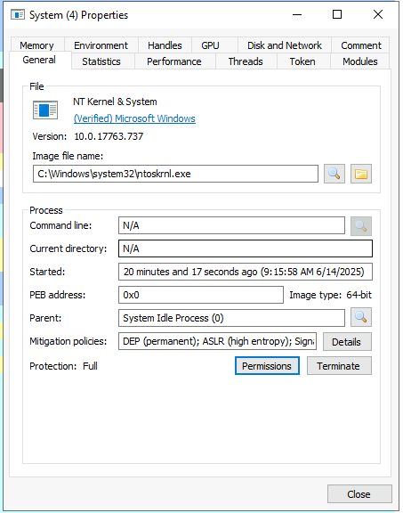

### Unusual Behavior

Anomalies indicate potential compromise:
- **Parent Process**: Anything other than System Idle Process (PID 0).
- **Multiple Instances**: Only one instance should exist.
- **Incorrect PID**: Must be PID 4.
- **Non-Session 0**: Should always run in Session 0.
- **Image Path Deviation**: Unexpected or non-verified paths.
- **Misspellings**: Variants like `Systen.exe` or `Systemm.exe`.
- **Non-SYSTEM User**: Running under another account.

**Screenshot**:
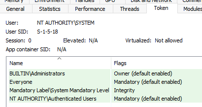

## The Session Manager Subsystem (smss.exe)

### Role and Function

The **smss.exe** (Session Manager Subsystem), or Windows Session Manager, is the first user-mode process started by the kernel. It initializes sessions, creates environment variables, sets up virtual memory paging files, and launches critical processes:
- **Session 0**: Starts `csrss.exe` (Windows subsystem) and `wininit.exe` (isolated system session).
- **Session 1**: Starts `csrss.exe` and `winlogon.exe` (user session).
- **Other Subsystems**: Launches subsystems listed in `HKLM\System\CurrentControlSet\Control\Session Manager\Subsystems`.

It copies itself into new sessions, with child instances self-terminating after session creation.

**Screenshots**:

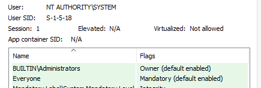
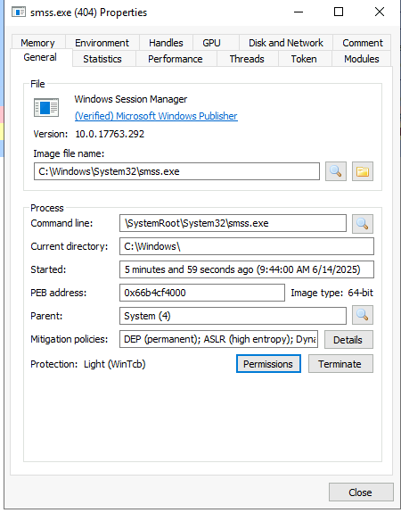

### Normal Behavior

- **Image Path**: `%SystemRoot%\System32\smss.exe`.
- **Parent Process**: System (PID 4).
- **Number of Instances**: One master instance; child instances per session (exit after creation).
- **User Account**: Local System.
- **Start Time**: Seconds after boot for the master instance.

### Unusual Behavior

- **Parent Process**: Not System (PID 4).
- **Image Path**: Not `C:\Windows\System32`.
- **Multiple Persistent Instances**: Children should terminate.
- **Non-SYSTEM User**: Must run as SYSTEM.
- **Unexpected Registry Entries**: Rogue subsystems in `HKLM\System\CurrentControlSet\Control\Session Manager\Subsystems`.

## The Client Server Runtime Process (csrss.exe)

### Role and Function

The **csrss.exe** (Client Server Runtime Process) is the user-mode component of the Windows subsystem, critical for system stability. It manages:
- Win32 console windows.
- Process and thread creation/deletion.
- Windows API availability.
- Drive letter mapping.
- Shutdown processes.

It runs in multiple instances (e.g., Session 0 and Session 1), loading DLLs like `csrsrv.dll`, `basesrv.dll`, and `winsrv.dll`.

**Screenshots**:
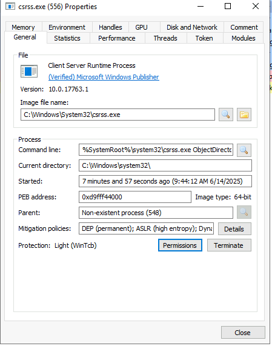
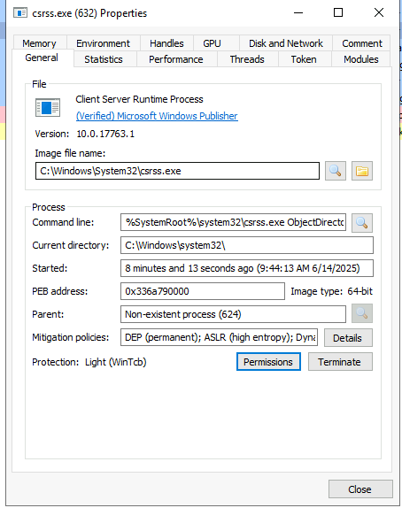

### Normal Behavior

- **Image Path**: `%SystemRoot%\System32\csrss.exe`.
- **Parent Process**: Created by `smss.exe` (which terminates, so no parent is listed).
- **Number of Instances**: Two or more (Session 0, Session 1, and additional sessions).
- **User Account**: Local System.
- **Start Time**: Seconds after boot for Session 0 and 1; later for new sessions.

### Unusual Behavior

- **Visible Parent Process**: `smss.exe` terminates after spawning.
- **Image Path**: Not `C:\Windows\System32`.
- **Misspellings**: E.g., `csrsss.exe`.
- **Non-SYSTEM User**: Must run as SYSTEM.

## The Windows Initialization Process (wininit.exe)

### Role and Function

The **wininit.exe** (Windows Initialization Process) launches critical Session 0 processes:
- `services.exe` (Service Control Manager).
- `lsass.exe` (Local Security Authority).
- `lsaiso.exe` (Credential Guard, if enabled).

It’s essential for system service initialization.

**Screenshot**:

### Normal Behavior

- **Image Path**: `%SystemRoot%\System32\wininit.exe`.
- **Parent Process**: Created by `smss.exe` (no parent listed).
- **Number of Instances**: One.
- **User Account**: Local System.
- **Start Time**: Seconds after boot.

### Unusual Behavior

- **Visible Parent Process**: `smss.exe` terminates.
- **Image Path**: Not `C:\Windows\System32`.
- **Misspellings**: E.g., `winit.exe`.
- **Multiple Instances**: Only one allowed.
- **Non-SYSTEM User**: Must run as SYSTEM.

## The Service Control Manager (services.exe)

### Role and Function

The **services.exe** (Service Control Manager) manages system services:
- Loads, starts, and stops services.
- Maintains a service database (`HKLM\System\CurrentControlSet\Services`).
- Loads auto-start device drivers.
- Sets the Last Known Good Configuration (`HKLM\System\Select\LastKnownGood`).

It’s the parent to processes like `svchost.exe`, `spoolsv.exe`, and `msmpeng.exe`.

**Screenshots**:
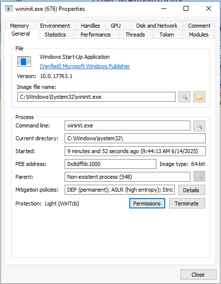
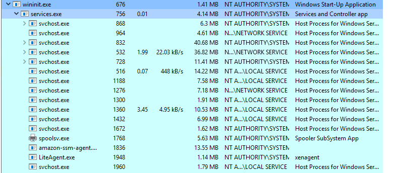
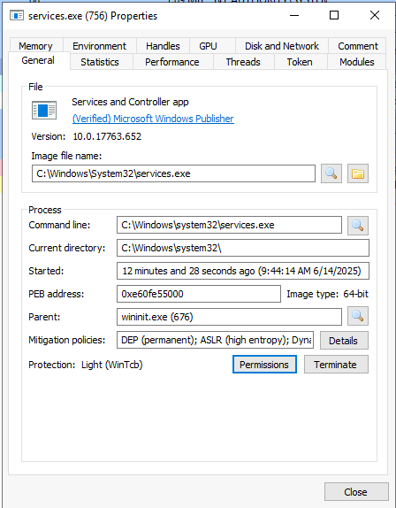

### Normal Behavior

- **Image Path**: `%SystemRoot%\System32\services.exe`.
- **Parent Process**: `wininit.exe`.
- **Number of Instances**: One.
- **User Account**: Local System.
- **Start Time**: Seconds after boot.

### Unusual Behavior

- **Parent Process**: Not `wininit.exe`.
- **Image Path**: Not `C:\Windows\System32`.
- **Misspellings**: E.g., `servces.exe`.
- **Multiple Instances**: Only one allowed.
- **Non-SYSTEM User**: Must run as SYSTEM.

## The Service Host (svchost.exe)

### Role and Function

The **svchost.exe** (Service Host) hosts Windows services as DLLs, reducing resource usage. Services are grouped using the `-k` parameter (e.g., `-k DcomLaunch`). Registry entries (`HKLM\SYSTEM\CurrentControlSet\Services\SERVICE_NAME\Parameters`) specify the `ServiceDLL`.

Since Windows 10 (1703), services may run in separate processes on systems with >3.5 GB RAM. Attackers often target `svchost.exe` by mimicking its name or installing malicious DLLs.

**Screenshot**:
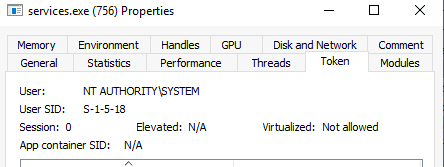

### Normal Behavior

- **Image Path**: `%SystemRoot%\System32\svchost.exe`.
- **Parent Process**: `services.exe`.
- **Number of Instances**: Multiple.
- **User Account**: SYSTEM, Network Service, Local Service, or logged-in user (Windows 10).
- **Start Time**: Seconds after boot; additional instances later.
- **Command Line**: Includes `-k` parameter.

### Unusual Behavior

- **Parent Process**: Not `services.exe`.
- **Image Path**: Not `C:\Windows\System32`.
- **Misspellings**: E.g., `scvhost.exe`.
- **Missing `-k` Parameter**: Indicates a rogue instance.

## The Local Security Authority (lsass.exe)

### Role and Function

The **lsass.exe** (Local Security Authority Subsystem Service) enforces security policies:
- Verifies user logins.
- Handles password changes.
- Creates access tokens.
- Writes to the Windows Security Log.

It uses authentication packages in `HKLM\System\CurrentControlSet\Control\Lsa`. Attackers target it with tools like Mimikatz to dump credentials or mimic its name.

**Screenshot**:
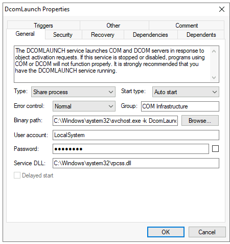

### Normal Behavior

- **Image Path**: `%SystemRoot%\System32\lsass.exe`.
- **Parent Process**: `wininit.exe`.
- **Number of Instances**: One.
- **User Account**: Local System.
- **Start Time**: Seconds after boot.

### Unusual Behavior

- **Parent Process**: Not `wininit.exe`.
- **Image Path**: Not `C:\Windows\System32`.
- **Misspellings**: E.g., `lsas.exe`.
- **Multiple Instances**: Only one allowed.
- **Non-SYSTEM User**: Must run as SYSTEM.

## The Windows Logon Manager (winlogon.exe)

### Role and Function

The **winlogon.exe** (Windows Logon) handles the Secure Attention Sequence (Ctrl+Alt+Delete), user profile loading (`NTUSER.DAT` into `HKCU`), and screensaver/lock screen functions. It’s launched by `smss.exe` in Session 1 with `csrss.exe`.

**Screenshots**:
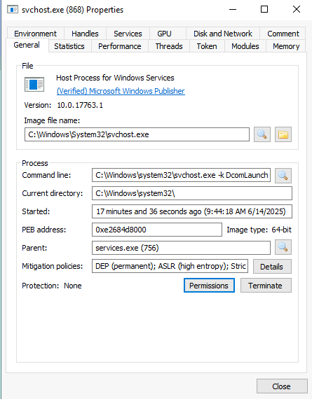
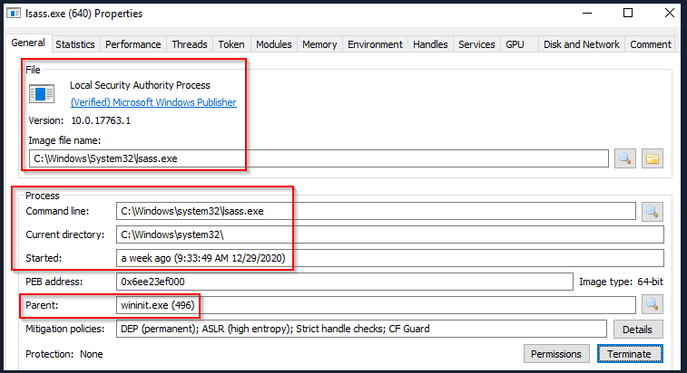

### Normal Behavior

- **Image Path**: `%SystemRoot%\System32\winlogon.exe`.
- **Parent Process**: Created by `smss.exe` (no parent listed).
- **Number of Instances**: One or more (per session, e.g., RDP).
- **User Account**: Local System.
- **Start Time**: Seconds after boot for Session 1; later for new sessions.

### Unusual Behavior

- **Visible Parent Process**: `smss.exe` terminates.
- **Image Path**: Not `C:\Windows\System32`.
- **Misspellings**: E.g., `winlogn.exe`.
- **Non-SYSTEM User**: Must run as SYSTEM.

## The Windows Explorer (explorer.exe)

### Role and Function

The **explorer.exe** (Windows Explorer) provides the desktop, Start Menu, Taskbar, and file explorer. Launched by `userinit.exe` (via `HKLM\Software\Microsoft\Windows NT\CurrentVersion\Winlogon\Shell`), `userinit.exe` exits after spawning it.

**Screenshot**:
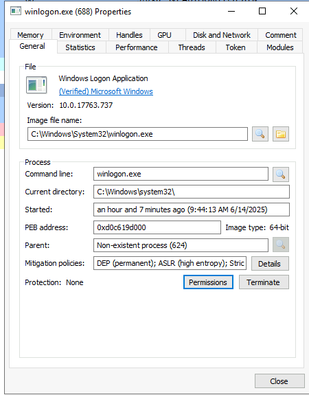

### Normal Behavior

- **Image Path**: `%SystemRoot%\explorer.exe`.
- **Parent Process**: Created by `userinit.exe` (no parent listed).
- **Number of Instances**: One or more per logged-in user.
- **User Account**: Logged-in user.
- **Start Time**: When a user logs in interactively.

### Unusual Behavior

- **Visible Parent Process**: `userinit.exe` exits.
- **Image Path**: Not `C:\Windows`.
- **Unknown User**: Not the logged-in user.
- **Misspellings**: E.g., `exploror.exe`.
- **Outbound TCP/IP Connections**: Explorer should not initiate network activity.
- **Non-Standard Shell**: Registry `Shell` value not `explorer.exe`.

## Citations

- Sysinternals Suite, https://docs.microsoft.com/en-us/sysinternals/
- Process Hacker, https://processhacker.sourceforge.io/
- SANS Hunt Evil Poster, https://www.sans.org/posters/hunt-evil/
- Core Processes in Windows, https://0xcybery.github.io/blog/Core-Processes-In-Windows-System
- Microsoft Windows Documentation, https://learn.microsoft.com/en-us/windows/win32/
- TryHackMe Intro to Endpoint Security, https://tryhackme.com/room/introtoendpointsecurity

---
