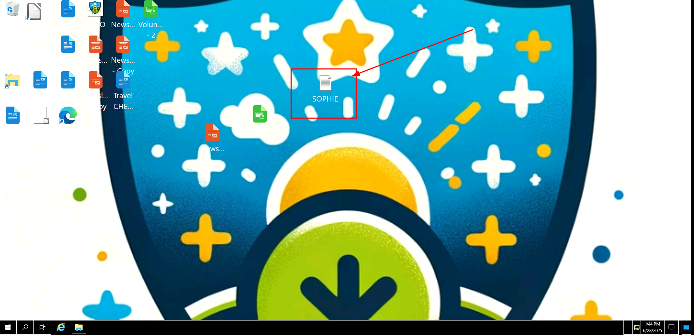
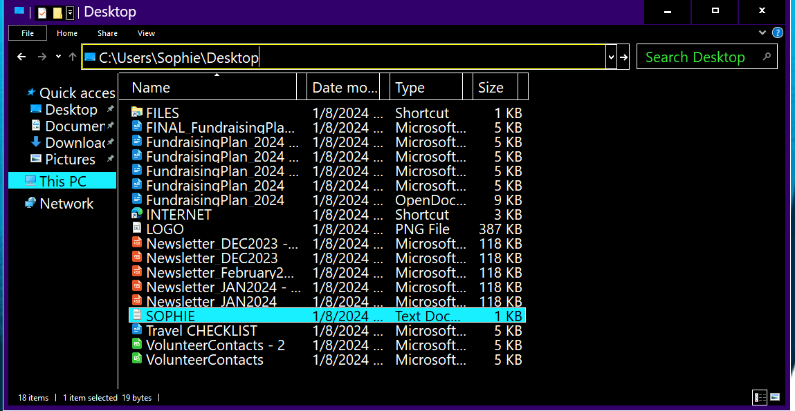
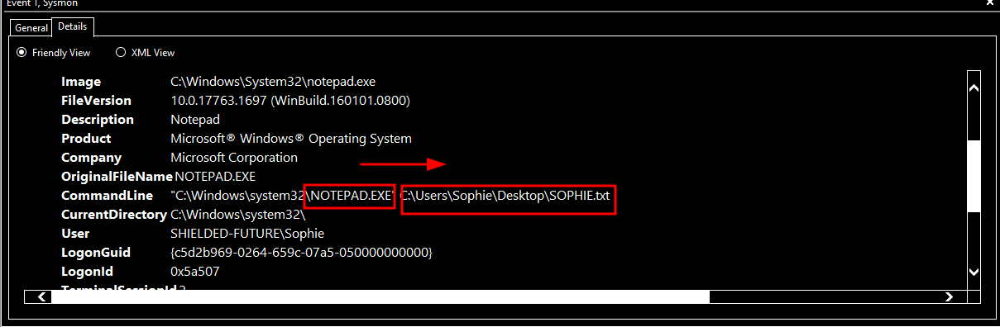
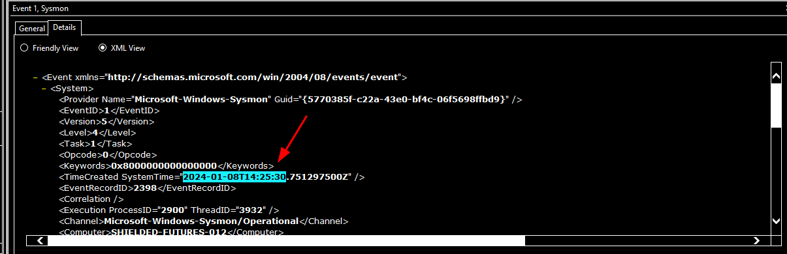
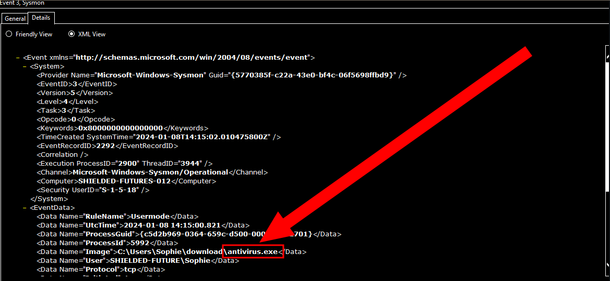
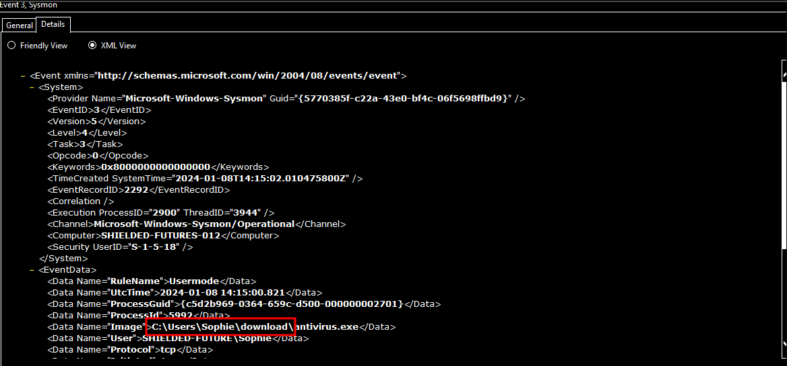
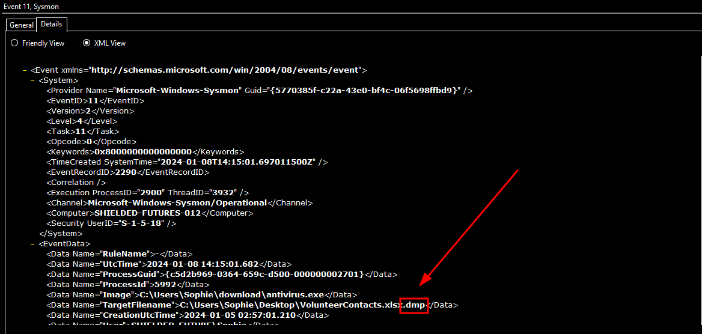
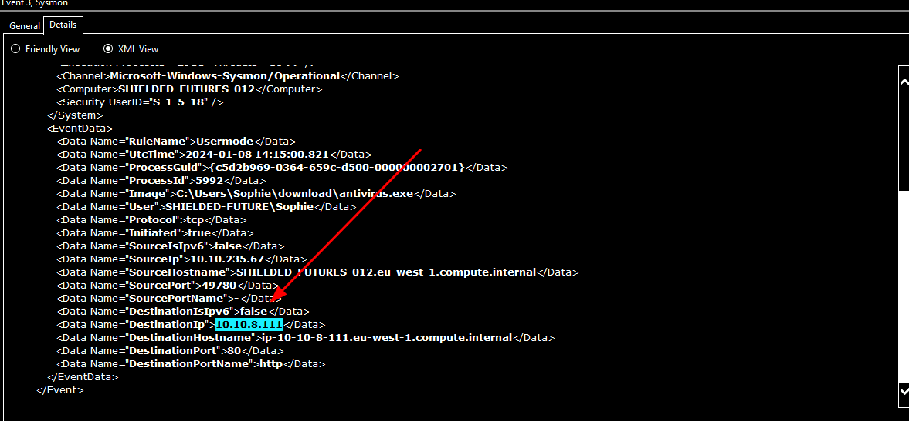
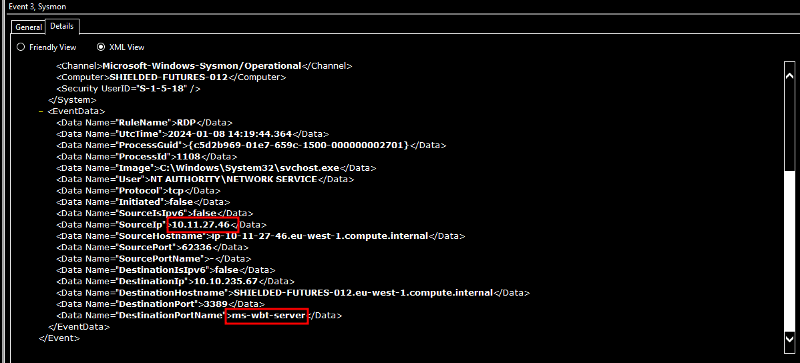
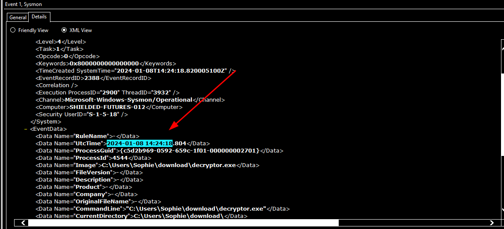

# Retracted thm ctf [here](https://tryhackme.com/room/retracted)
# Incident Analysis: Sophie's Ransomware Incident with Windows Event Viewer and Sysmon 

On January 8, 2024, Sophie, a user at a charity organization, experienced a ransomware incident after downloading an "antivirus" installer. The malware encrypted files, displayed a ransom note, and altered her desktop wallpaper. An intruder accessed her system via RDP, realized the target was a charity, decrypted the files, and left a message (`SOPHIE.txt`) suggesting a Bitcoin donation. A Bitcoin donation was later reported, suggesting a possible change of heart. 

## Investigation Questions and Findings

### 1. Full Path of the Text File Containing the Message
**Question**: What is the full path of the text file containing the "message"?

**Search**: Identified a text file named `SOPHIE.txt` on the desktop via Windows Event Viewer logs.

**Finding**: The file is located in the user Sophie's desktop directory, confirmed by Event Viewer logs showing file creation.

**Log**:
- Event Viewer log and screenshot show `SOPHIE.txt` on the desktop.

**Answer**: The full path is `C:\Users\Sophie\Desktop\SOPHIE.txt`.

### 2. Program Used to Create the Text File
**Question**: What program was used to create the text file?

**Search**: Analyzed Sysmon event logs in Windows Event Viewer for file creation events related to `SOPHIE.txt`.

**Finding**: Sysmon logs confirm `notepad.exe` created the file.

**Log**:
- Sysmon event (Event ID 11) shows `notepad.exe` creating `SOPHIE.txt`.

**Answer**: The program used is `notepad.exe`.

### 3. Time of Execution of the Process That Created the Text File
**Question**: What is the time of execution of the process that created the text file? (Timezone UTC, Format YYYY-MM-DD hh:mm:ss)

**Search**: Checked Sysmon logs in Windows Event Viewer for the `notepad.exe` process creating `SOPHIE.txt`.

**Finding**: The execution time is recorded in the Sysmon log.

**Log**:
- Sysmon event (Event ID 11) shows `notepad.exe` execution at 2024-01-08 14:25:30 UTC.

**Answer**: The execution time is `2024-01-08 14:25:30`.

### 4. Filename of the "Installer"
**Question**: What is the filename of this "installer"? (Including the file extension)

**Search**: Queried Windows Event Viewer for download events and checked Microsoft Edge download history.

**Finding**: The malicious installer is identified as `antivirus.exe`.

**Log**:
- Event Viewer log and Edge download history confirm the file.

**Answer**: The filename is `antivirus.exe`.

### 5. Download Location of the Installer
**Question**: What is the download location of this installer?

**Search**: Analyzed Windows Event Viewer logs and Microsoft Edge download history for the local path where `antivirus.exe` was saved.

**Finding**: The installer was downloaded and saved to `C:\Users\Sophie\download`.

**Log**:
- Event Viewer log (Sysmon Event ID 1) and Edge download history confirm the file was saved to the Downloads folder.

**Answer**: The download location is `C:\Users\Sophie\download`.

### 6. File Extension Added by the Installer
**Question**: The installer encrypts files and then adds a file extension to the end of the file name. What is this file extension?

**Search**: Filtered Windows Event Viewer for Sysmon Event ID 11 (file creation) related to `antivirus.exe`.

**Finding**: Files encrypted by `antivirus.exe` have the `.dmp` extension appended.

**Log**:
- Sysmon log (Event ID 11) shows encrypted files with `.dmp` extension.

**Answer**: The file extension is `.dmp`.

### 7. IP Address Contacted by the Installer
**Question**: The installer reached out to an IP. What is this IP?

**Search**: Analyzed Windows Event Viewer for Sysmon network connection events (Event ID 3) related to `antivirus.exe`.

**Finding**: The installer communicated with `10.10.8.111`.

**Log**:
- Sysmon log (Event ID 3) confirms the IP.

**Answer**: The IP is `10.10.8.111`.

### 8. Source IP of RDP Login
**Question**: The threat actor logged in via RDP right after the “installer” was downloaded. What is the source IP?

**Search**: Filtered Windows Event Viewer for network connections (ID:3) for RDP connections around the time `antivirus.exe` was downloaded.

**Finding**: The RDP login originated from `10.11.27.46`.

**Log**:
- Event Viewer log shows RDP connection via `ms-wbt-server`.

**Answer**: The source IP is `10.11.27.46`.

### 9. Time the Decryptor File Was Run
**Question**: This other person downloaded a file and ran it. When was this file run? (Timezone UTC, Format YYYY-MM-DD hh:mm:ss)

**Search**: Searched Windows Event Viewer for Sysmon process creation events (Event ID 1) involving `decryptor.exe`.

**Finding**: Sysmon logs show `decryptor.exe` executed at 2024-01-08 14:24:18 UTC.

**Log**:
- Sysmon log (Event ID 1) confirms `decryptor.exe` execution time.

**Answer**: The file was run at `2024-01-08 14:24:18`.

### 10. Sequential Order of Events
**Question**: Arrange the following events in sequential order from 1 to 7, based on the timeline in which they occurred.

**Events Provided**:
- Sophie downloaded the malware and ran it.
- The downloaded malware encrypted the files on the computer and showed a ransomware note.
- After seeing the ransomware note, Sophie ran out and reached out to you for help.
- While Sophie was away, an intruder logged into Sophie’s machine via RDP and started looking around.
- The intruder realized he infected a charity organization. He then downloaded a decryptor and decrypted all the files.
- After all the files are restored, the intruder left the desktop telling Sophie to check her Bitcoin.
- Sophie and I arrive on the scene to investigate. At this point, the intruder was gone.

**Analysis**:
- **Event 1**: Sophie downloaded and ran `antivirus.exe`.
- **Event 2**: `antivirus.exe` encrypted files with `.dmp` extension and displayed a ransom note.
- **Event 3**: Sophie saw the ransom note and contacted help (no specific log, but follows encryption).
- **Event 4**: Intruder logged in via RDP from `10.11.27.46` (Event Viewer log, 9.png).
- **Event 5**: Intruder ran `decryptor.exe` at 2024-01-08 14:24:18 to restore files (Sysmon Event ID 1, 11.png).
- **Event 6**: Intruder created `SOPHIE.txt` at 2024-01-08 14:25:30 using `notepad.exe` (Sysmon Event ID 11, 5.png).
- **Event 7**: Sophie and investigator arrived after the intruder left (post-14:25:30).
