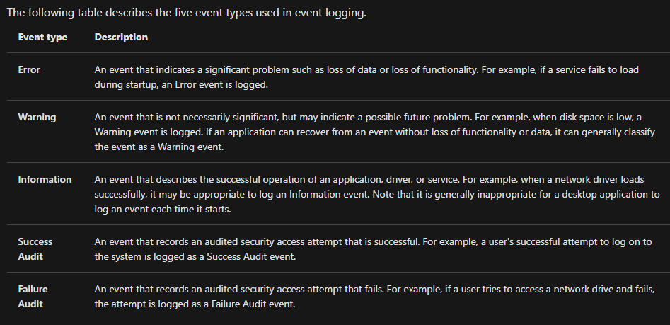
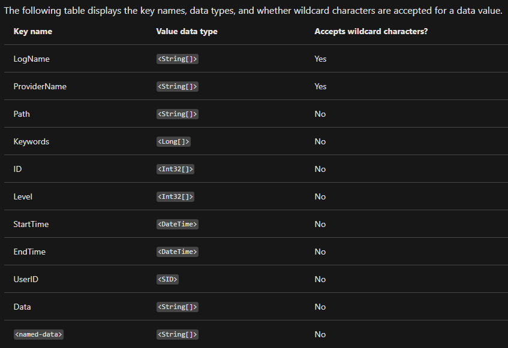

## What Are Windows Event Logs?

Per Wikipedia:

> "Event logs record events taking place in the execution of a system to provide an audit trail that can be used to understand the activity of the system and to diagnose problems. They are essential to understand the activities of complex systems, particularly in applications with little user interaction (such as server applications)."

For **system administrators**, **IT technicians**, and **desktop engineers**, event logs help troubleshoot endpoint issues, as Windows automatically logs system, application, and security events. For **blue team defenders**, they’re critical for:

- **Incident Investigation**: Finding clues about security incidents or system failures.
- **Event Correlation**: Combining logs from multiple sources (e.g., endpoints, appliances) to uncover patterns, using **SIEMs** like Splunk or Elastic.
- **Threat Detection**: Spotting unauthorized access or anomalies.

In large enterprises, **SIEMs** centralize logs for scalable querying, as manually checking individual machines is impractical.

**Note**: This guide focuses on **Windows Event Logs**, not Linux **Syslog** or macOS logging.

**Screenshot**:


## Characteristics of Windows Event Logs

Windows Event Logs use a proprietary binary format (`.evt` or `.evtx`) stored at `C:\Windows\System32\winevt\Logs`. They can be translated into XML via the Windows API. Log categories include:

- **System Logs**: OS events (e.g., hardware changes, drivers).
- **Security Logs**: Logon/logoff activities, useful for unauthorized access investigations.
- **Application Logs**: Application errors and warnings.
- **Directory Service Events**: Active Directory changes on domain controllers.
- **File Replication Service Events**: Group Policy and logon script sharing.
- **DNS Event Logs**: DNS server activities.
- **Custom Logs**: Application-specific events with custom parameters.

## Accessing Windows Event Logs

Three methods to access logs:

1. **Event Viewer**:
   - GUI-based, launched via taskbar > **Event Viewer** or `eventvwr.msc`.
   - Quick for interactive analysis.

2. **Wevtutil.exe**:
   - Command-line tool for querying and managing logs.
   - Help: `wevtutil.exe /?`.
   - Example: List logs:
     ```powershell
     wevtutil el
     ```

3. **Get-WinEvent**:
   - PowerShell cmdlet for advanced queries, replacing `Get-EventLog`.
   - Supports XPath, XML, and hash table filters.
   - Help: `Get-Help Get-WinEvent`.

## Elements of Windows Event Logs

Log entries include:
- **Log Name**: Category (e.g., Security).
- **Source/Provider**: Event source (e.g., WLMS).
- **Event ID**: Unique identifier (e.g., 4624 for logon).
- **Level**: Severity (e.g., Information, Error).
- **TimeCreated**: Timestamp.
- **Message**: Details.

## Querying with Wevtutil.exe

**Wevtutil.exe** commands:
- `el`: List logs.
- `qe`: Query events.
- `cl`: Clear logs.

**Example**: Query Application log for Event ID 100:
```powershell
wevtutil qe Application /q:"*/System[EventID=100]" /f:text /c:1
```

**Output**:
```
Event[0]:
  Log Name: Application
  Source: WLMS
  Date: 2020-12-14T17:09:08.940
  Event ID: 100
  Task: None
  Level: Information
  Opcode: Info
  Keyword: Classic
  User: N/A
  User Name: N/A
  Computer: WIN-1O0UJBNP9G7
  Description: N/A
```

## Querying with Get-WinEvent

**Get-WinEvent** supports:
- **Where-Object**: Basic filtering.
- **FilterHashtable**: Efficient for large logs.
- **FilterXPath**: XML-based precision.

### Example 1: List Logs
```powershell
Get-WinEvent -ListLog *
```

**Output**:
```
LogMode   MaximumSizeInBytes RecordCount LogName
-------   ------------------ ----------- -------
Circular            15532032       14500 Application
Circular             1052672         117 Azure Information Protection
...
```

### Example 2: Filter with FilterHashtable
```powershell
Get-WinEvent -FilterHashtable @{ LogName='Application'; ProviderName='WLMS' }
```

**Output**:
```
ProviderName: WLMS
TimeCreated                     Id LevelDisplayName Message
-----------                     -- ---------------- -------
12/21/2020 4:23:47 AM          100 Information
12/18/2020 3:18:57 PM          100 Information
...
```

**Screenshot**:


### Example 3: XPath for Event ID
```powershell
Get-WinEvent -LogName Application -FilterXPath '*/System/EventID=100'
```

**Output**:
```
ProviderName: WLMS
TimeCreated                     Id LevelDisplayName Message
-----------                     -- ---------------- -------
12/21/2020 4:23:47 AM          100 Information
12/18/2020 3:18:57 PM          100 Information
...
```

### Example 4: Combined XPath (Event ID and Provider)
```powershell
Get-WinEvent -LogName Application -FilterXPath '*/System/EventID=101 and */System/Provider[@Name="WLMS"]'
```

**Output**:
```
ProviderName: WLMS
TimeCreated                     Id LevelDisplayName Message
-----------                     -- ---------------- -------
12/15/2020 8:48:34 AM          101 Information
12/14/2020 7:12:18 PM          101 Information
...
```

### Example 5: EventData Query
```powershell
Get-WinEvent -LogName Security -FilterXPath '*/EventData/Data[@Name="TargetUserName"]="System"' -MaxEvents 1
```

**Output**:
```
ProviderName: Microsoft-Windows-Security-Auditing
TimeCreated                     Id LevelDisplayName Message
-----------                     -- ---------------- -------
12/21/2020 10:50:26 AM         4624 Information     An account was successfully logged on...
```

## Building Queries

### FilterHashtable
- **Syntax**: `@{ Key=Value; Key=Value }`
- **Tips**: Use Event Viewer to identify keys (e.g., LogName, EventID). More efficient than `Where-Object`.

### XPath
- **Syntax**: Start with `*` or `Event`, then `System` or `EventData` (e.g., `*/System/EventID=100`).
- **Example**: `*[System[(Level <= 3) and TimeCreated[timediff(@SystemTime) <= 86400000]]]`
  - Filters events with severity ≤3 in the last 24 hours.
- **Tips**: Prototype in Event Viewer’s Custom Views.

## Practical Tips for Analysts

1. **Event Viewer**:
   - Filter by Event ID (e.g., 4624) or Level (Error) for quick insights.
   - Export to XML for SIEMs.

2. **Wevtutil**:
   - Script exports: `wevtutil epl Security security_log.evtx`.
   - Query specific events: `wevtutil qe Security /q:"*/System[EventID=4624]"`.

3. **Get-WinEvent**:
   - Use `FilterHashtable` for large logs.
   - Customize output:
     ```powershell
     Get-WinEvent -LogName Security -FilterHashtable @{ Id=4624 } | Select-Object TimeCreated, Message
     ```

4. **SIEM Integration**:
   - Forward logs to Splunk/Elastic for correlation (e.g., Security Event ID 4624 with Sysmon Event ID 3).

5. **Monitor Key Events**:
   - **Security**: 4624 (logon), 4672 (privilege assignment).
   - **System**: 6005 (system start), 7036 (service change).
   - **Application**: Application crashes or unknown providers.

6. **Threat Hunting**:
   - Check for unusual `TargetUserName` in Event ID 4624.
   - Monitor `lsass.exe` registry access (Event ID 4657) for credential dumping.

7. **Safety**:
   - Analyze logs in a sandboxed VM.

## Extended Insights

- **Attack Indicators**:
  - **Mimikatz**: Event ID 4657 for `HKLM\System\CurrentControlSet\Control\Lsa`.
  - **Rogue Services**: Errors from unknown providers in Application logs.
  - **Lateral Movement**: Correlate Event ID 4624 with Sysmon network events.

- **Mitigations**:
   - Enable audit policies: `auditpol /set /subcategory:"Logon" /success:enable`.
   - Use Sysmon for enhanced logging.
   - Deploy Wazuh for real-time monitoring.

- **Baselining**:
   - Identify normal Event IDs and providers to spot outliers.

