# Investigating VPN Logs with Elastic Stack

CyberT, a US-based company, is monitoring employee VPN logs for January 2022 to detect anomalies. The SOC team is tasked with analyzing the logs in the `vpn_connections` index using the Elastic Stack. Key details include the termination of user Johny Brown on January 1, 2022, and observed failed connection attempts. This README explains the Elastic Stack components and demonstrates Kibana Query Language (KQL) usage with examples, directly reflecting the provided input and screenshots.

## Scenario

- **Objective**: Examine VPN logs for January 2022 to identify anomalies.
- **Index**: All VPN logs are ingested into `vpn_connections`.
- **Key Context**:
  - Johny Brown was terminated on January 1, 2022.
  - Failed connection attempts need investigation.

## Elastic Stack

The Elastic Stack is a collection of open-source tools to ingest, process, store, search, and visualize data in real-time from any source and format.

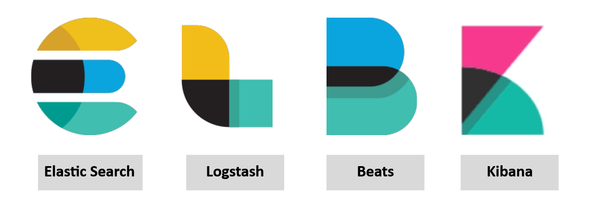

### Elasticsearch
Elasticsearch is a full-text search and analytics engine that stores JSON-formatted documents. It is used to store, analyze, and correlate VPN logs in the `vpn_connections` index, supporting RESTful API interactions.

### Logstash
Logstash is a data processing engine that:
- Ingests data from sources (e.g., files, ports).
- Applies filters to normalize data.
- Outputs data to destinations like Elasticsearch or Kibana.

**Logstash Configuration Structure**:
- **Input**: Defines data sources (e.g., VPN log files).
- **Filter**: Normalizes logs into field-value pairs.
- **Output**: Sends processed data to Elasticsearch, Kibana, or other destinations.

**Reference**:
- [Input Plugins](https://www.elastic.co/guide/en/logstash/8.1/input-plugins.html)
- [Filter Plugins](https://www.elastic.co/guide/en/logstash/8.1/filter-plugins.html)
- [Output Plugins](https://www.elastic.co/guide/en/logstash/8.1/output-plugins.html)

### Beats
Beats are host-based agents (data shippers) that collect specific data and send it to Logstash or Elasticsearch. Examples include:
- **Winlogbeat**: Collects Windows event logs (e.g., VPN authentication).
- **Packetbeat**: Captures network traffic flows.

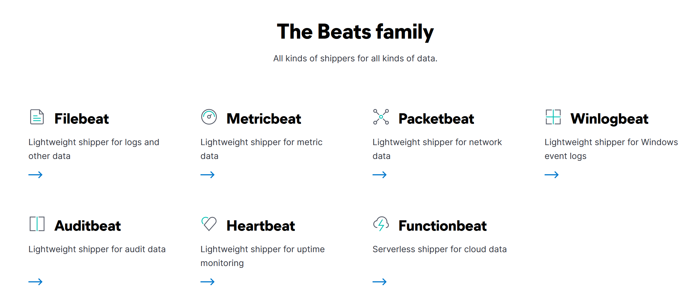

### Kibana
Kibana is a web-based interface for visualizing and analyzing Elasticsearch data. It supports real-time log searching and visualization via dashboards and KQL.

**KQL Toggle**: KQL can be enabled/disabled in Kibana’s settings.
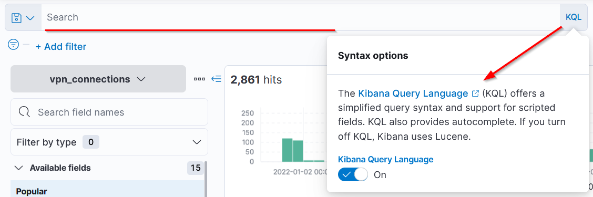

### How Components Work Together
- **Beats**: Collect data from endpoints (e.g., VPN logs).
- **Logstash**: Parses/normalizes data into field-value pairs and sends it to Elasticsearch.
- **Elasticsearch**: Stores and indexes data for searching.
- **Kibana**: Displays and visualizes data with charts, tables, and infographics.

## Kibana Query Language (KQL)

KQL is used to search logs in the `vpn_connections` index via Kibana’s Discover tab. It supports:
- **Free Text Search**: Searches terms across all fields.
- **Field-Based Search**: Targets specific fields with `FIELD:VALUE` syntax.

### Free Text Search
Searches for terms in any field, matching whole words.

- **Search: "United States"**:
  ```kql
  United States
  ```
  - Returns 2304 hits for logs containing "United States" in any field (e.g., `Source_Country`).
  - 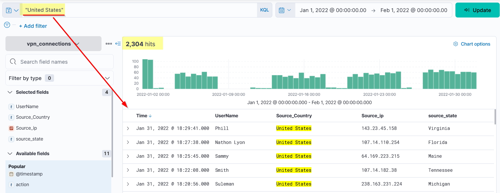

- **Search: "United"**:
  ```kql
  United
  ```
  - Returns no results, as KQL matches whole terms, not partial words.
  - 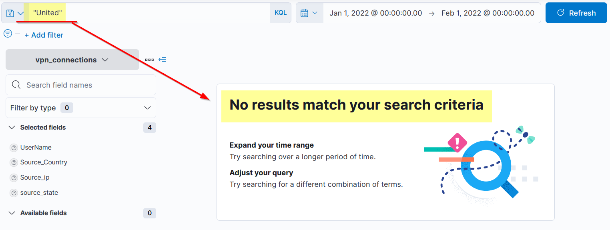

#### Wildcard Search
Uses `*` to match parts of a term.

- **Search: "United*"**:
  ```kql
  United*
  ```
  - Returns logs containing terms starting with "United" (e.g., United States, United Nations).
  - 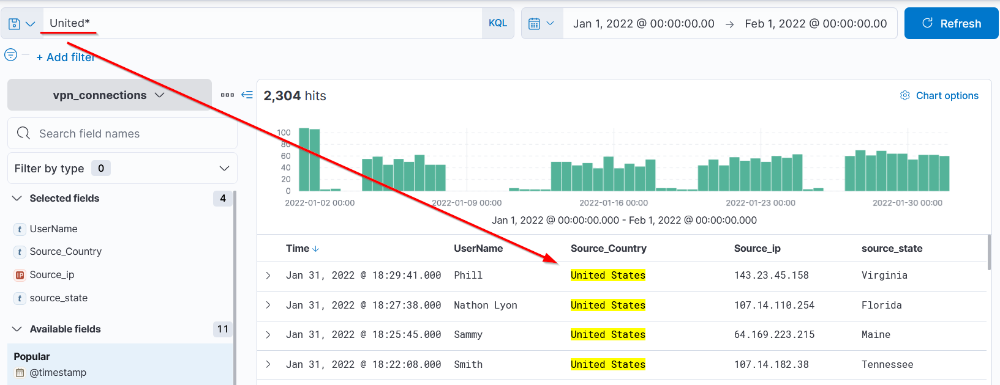

#### Logical Operators
- **OR Operator**:
  ```kql
  "United States" OR "England"
  ```
  - Returns logs containing either "United States" or "England".
  - 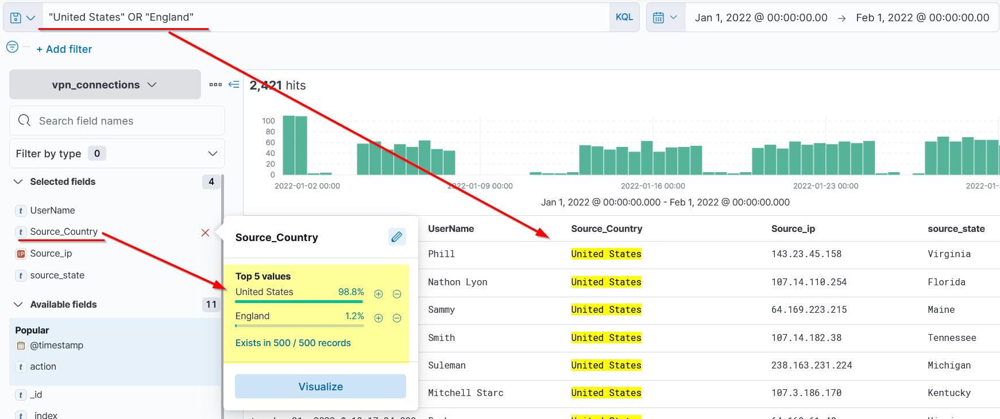

- **AND Operator**:
  ```kql
  "United States" AND "Virginia"
  ```
  - Returns logs containing both "United States" and "Virginia".
  - 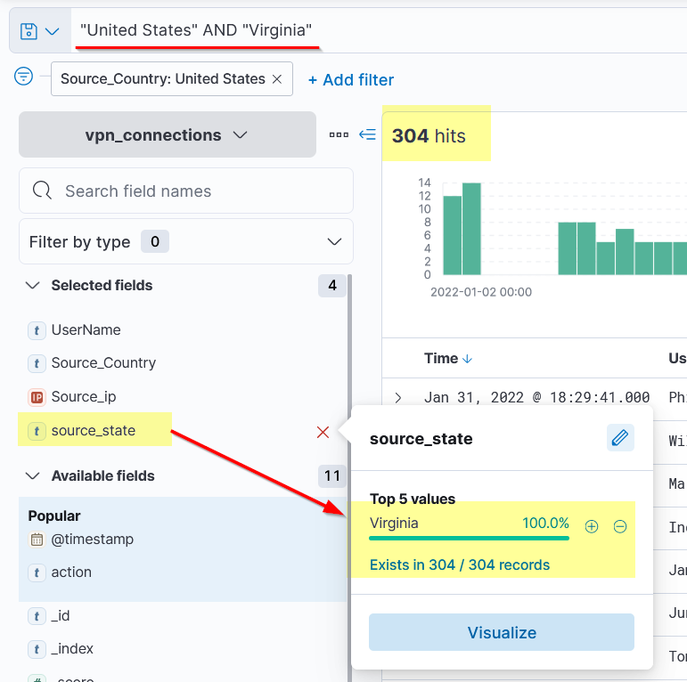

- **NOT Operator**:
  ```kql
  "United States" AND NOT "Florida"
  ```
  - Returns logs from "United States" excluding those with "Florida".
  - 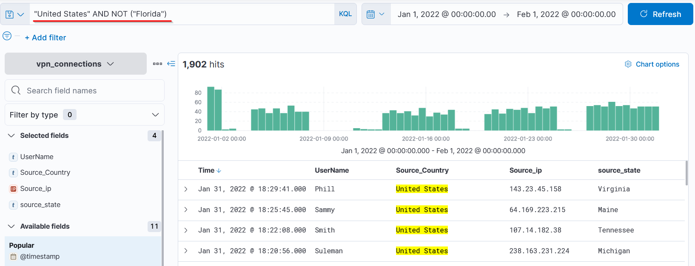

### Field-Based Search
Uses `FIELD:VALUE` syntax to target specific fields.

- **Search: Specific IP and User**:
  ```kql
  Source_ip:238.163.231.224 AND UserName:Suleman
  ```
  - Returns logs where `Source_ip` is `238.163.231.224` and `UserName` is `Suleman`.
  - 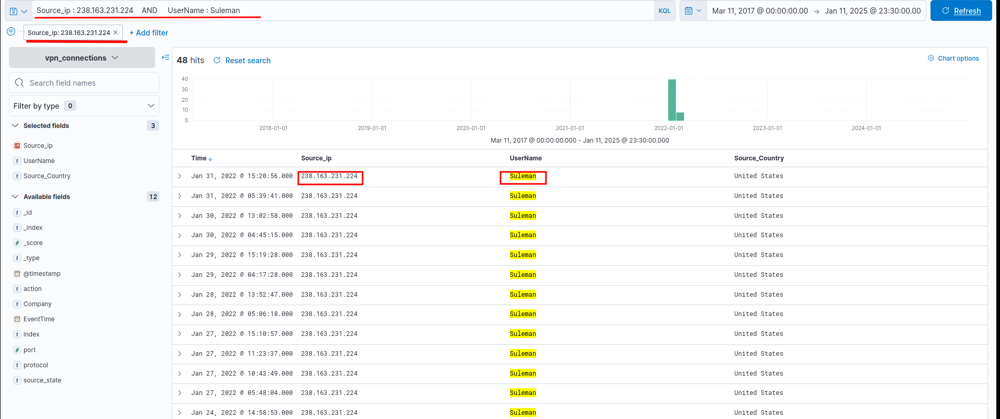

### Investigation Queries

#### 1. Logs for Users James or Albert from the United States
**Query**: Filter logs from `Source_Country:United States` for users `James` or `Albert`.

```kql
Source_Country:"United States" AND (UserName:"James" OR UserName:"Albert")
```

- **Result**: 161 records returned.
- 

#### 2. VPN Connections by Terminated User Johny Brown
**Query**: Find VPN connections for Johny Brown after his termination on January 1, 2022.

```kql
UserName:"Johny Brown" 
```

- **Result**: 1 VPN connection observed.
- 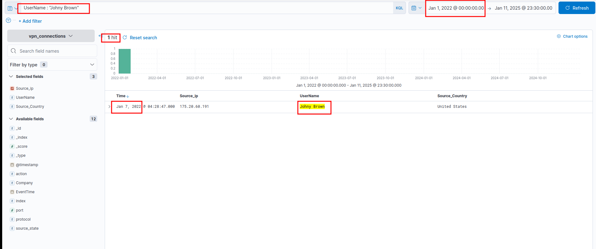

#### 3/4. User with the Greatest Number of Failed Attempts
**Query**: Aggregate failed attempts by `UserName` where `action:failed` and Count failed VPN attempts for January 2022.

```kql
action:failed
```

- **Result**: User `simon` had the most failed attempts
- **Result**: 274 failed attempts observed.

- 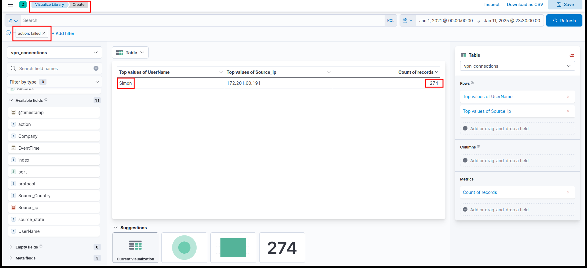


## Documentation
- Elastic Stack: [www.elastic.co/guide](https://www.elastic.co/guide)
- KQL Reference: [www.elastic.co/guide/en/kibana/7.17/kuery-query.html](https://www.elastic.co/guide/en/kibana/7.17/kuery-query.html)
